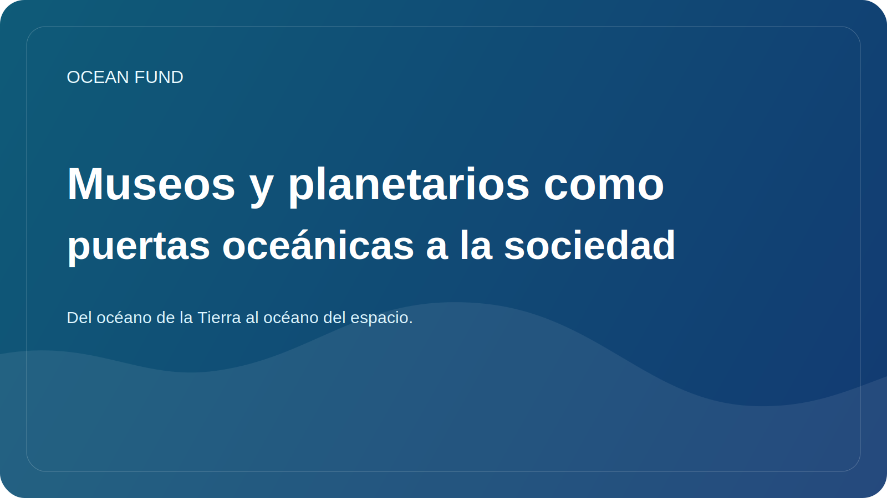

# Museos y planetarios como puertas oceánicas a la sociedad

El tema del océano no debe vivir sólo en laboratorios, informes y portales de datos especializados. Para que la sociedad comprenda verdaderamente el papel del océano, necesitamos espacios donde el conocimiento se haga visible, emocionalmente accesible e intelectualmente coherente. Por eso los museos, los centros científicos y los planetarios son tan importantes para la agenda oceánica.

El museo sabe cómo hacer lo que los documentos secos rara vez hacen: convertir un sistema complejo en una experiencia vivida. A través de una exposición, un mapa, un modelo, un vídeo, una estación interactiva o un programa de conferencias, una persona puede ver el océano no como un telón de fondo abstracto del planeta, sino como un entorno vivo conectado con el clima, la biodiversidad, los datos y el futuro de las costas.

Los planetarios añaden otra dimensión a esto. Naturalmente, ayudan a construir un puente entre el océano de la Tierra y la perspectiva cósmica. A través de observaciones satelitales, observaciones de la Tierra, mundos oceánicos y el tema de la habitabilidad, el planetario puede mostrar que hablar sobre el océano es a la vez una conversación sobre nuestro planeta y sobre la cuestión más amplia de la vida en el Universo.

Un puente así es especialmente valioso porque hace que la ciencia sea más amplia e interesante sin perder rigor. La oceanología se encuentra con la astrobiología. Los datos marinos se encuentran con los satélites. El tema climático se encuentra con la imaginación a largo plazo. Este es un formato muy fuerte para la ciencia pública.

Para el Fondo Oceánico, los museos y planetarios no son sólo socios potenciales para “actividades educativas”. Se trata de instituciones capaces de transformar la narrativa pública en una infraestructura cultural sostenible. A través de ellos se pueden lanzar conferencias, módulos expositivos, visualizaciones, kits educativos, formatos de eventos y puentes interdisciplinarios entre el océano, los datos y el espacio.

Si la sociedad realmente quiere aprender a ver el océano como el sistema central de vida en la Tierra, necesita algo más que papeles y tableros. Necesita una puerta de entrada cultural. Y los museos con planetarios son una de las puertas de entrada más fuertes.
