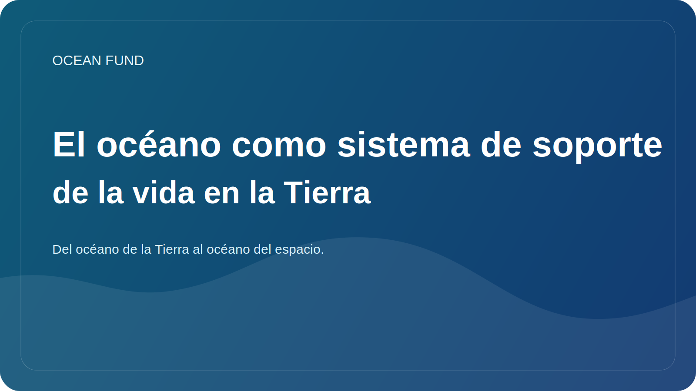

# El oceano como sistema de soporte vital de la Tierra

Cuando la gente piensa en el oceano, suele imaginar agua, costas, tormentas, peces, barcos o hermosos horizontes azules. Pero el oceano no importa solo como paisaje o como recurso. Funciona como uno de los principales sistemas de soporte vital de la Tierra.

El oceano ayuda a regular el clima del planeta. Absorbe una gran parte del calor excedente generado por el aumento de los gases de efecto invernadero en la atmosfera. Sin ese amortiguador, la alteracion climatica sobre la tierra firme seria aun mas intensa y destructiva. El oceano tambien participa en el ciclo global del carbono mediante procesos fisicos, quimicos y biologicos.

Su papel climatico no se limita a las cifras de los informes cientificos. El estado del oceano influye en los patrones de lluvia, la intensidad de las tormentas, la resiliencia de los ecosistemas costeros y la calidad de vida en las regiones litorales. A traves de la atmosfera y de la circulacion oceanica, esta conectado con la agricultura, los sistemas alimentarios, la infraestructura urbana y la seguridad de millones de personas.

El oceano es tambien un inmenso entorno biologico. Los ecosistemas marinos sostienen una extraordinaria diversidad, desde plancton y corales hasta mamiferos marinos y organismos de aguas profundas que aun se comprenden solo parcialmente. Esa biodiversidad importa no solo por si misma. Esta vinculada a la resiliencia de los ecosistemas, a las redes troficas, a la salud costera y a la capacidad de la naturaleza para responder al estres.

Al mismo tiempo, el oceano sigue siendo parcialmente desconocido. Sabemos mucho mas que hace un siglo, pero todavia no hemos cartografiado el fondo marino con el detalle deseado, ni descrito todas las especies marinas, ni comprendido por completo como cambiara el oceano bajo el calentamiento, la acidificacion, la desoxigenacion, la contaminacion y la presion industrial.

Por eso el oceano no puede seguir siendo solo un tema para circulos de especialistas. El conocimiento oceanico debe incorporarse a la educacion, la ciencia publica, el trabajo con datos, la cultura y la cooperacion internacional. Se necesita no solo investigacion, sino tambien traduccion del conocimiento en mapas, ensayos, visualizaciones, conferencias, registros abiertos de datos y plataformas de interes publico.

Para Ocean Fund, el oceano no es un tema azul abstracto, sino un sistema vivo central del planeta. Si la sociedad quiere comprender el clima, la resiliencia, la biodiversidad y el futuro de las regiones costeras, necesita un lenguaje claro para pensar el oceano. Por eso el oceano debe tratarse no como un fondo, sino como uno de los principales objetos del conocimiento publico del siglo XXI.

