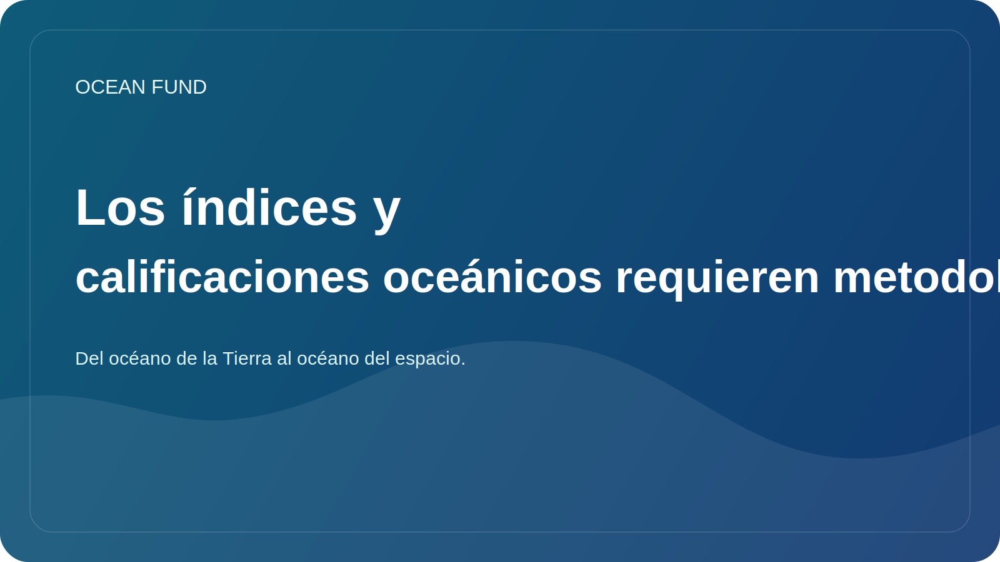

# Los índices y calificaciones oceánicos requieren metodología

Los índices y las calificaciones parecen muy atractivos. Prometen comparaciones rápidas, números claros y una manera conveniente de hablar sobre realidades complejas. En la agenda oceánica, esto resulta especialmente tentador: demasiados temas, demasiados actores, demasiados niveles de incertidumbre. Me gustaría tener al menos un indicador simple.

Pero aquí es donde entra el riesgo. Cuanto más complejo sea el sistema, más cuidado se debe tener al tratar de reducirlo a un solo número o a una escala comparativa conveniente. Si un índice no explica qué datos se utilizan, cómo se eligen las ponderaciones, cómo se contabilizan las brechas, cómo se interpretan las incertidumbres y qué se mide exactamente, no se convierte en una herramienta de conocimiento sino en una herramienta de ilusión.

Los índices oceánicos pueden resultar muy útiles si funcionan con honestidad. Ayudan a ver patrones, notar diferencias entre regiones, entablar conversaciones sobre políticas y crear un lenguaje común para organizaciones, donantes, investigadores y proyectos públicos. Pero sólo con la condición de que el índice no oculte la metodología detrás de una hermosa visualización.

Para Ocean Fund, este tema es especialmente importante porque ya tenemos una capa de índice interna y externa: resúmenes de sitios, mapas de datos, atlas, colas de publicación, temas de tareas. Esto significa que el proyecto necesita crear una cultura de transparencia metodológica desde el principio. Si llamamos a algo índice, calificación, registro o atlas, debemos mostrar claramente los límites de dicha herramienta.

Un buen índice no simplifica la realidad hasta el punto de la vacuidad. Le ayuda a navegar mientras lo mantiene honesto. Un mal índice da la impresión de precisión cuando sólo hay un conjunto de señales poco comparables. La diferencia entre ellos es la metodología.

Por tanto, la conversación sobre índices oceánicos debe ir no sólo en el plano del diseño y la comunicación, sino también en el plano de la responsabilidad epistémica. Un número sin explicación puede ser más peligroso que ningún número. Y un índice con lógica transparente puede convertirse en una poderosa herramienta pública para navegar en un mundo oceánico complejo.
