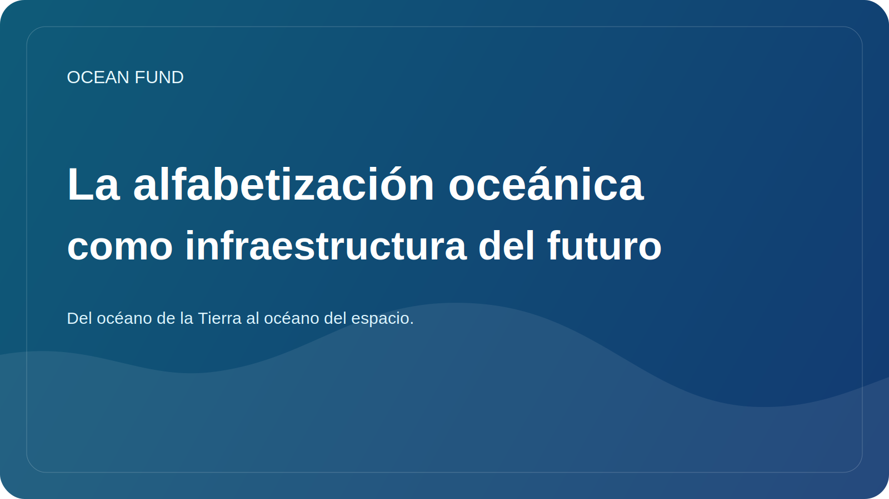

# La alfabetización oceánica como infraestructura del futuro

La alfabetización sobre los océanos a menudo suena como algo extra: un tema educativo útil, un buen formato para un museo, algo bueno para los programas escolares. Pero, en realidad, la alfabetización oceánica debe considerarse de manera más amplia. Esto no es un adorno de la agenda medioambiental, sino una de las infraestructuras del futuro.

Si una sociedad no comprende bien el papel del océano, comprenderá peor el clima, la biodiversidad, los riesgos costeros, los recursos marinos, las cadenas de suministro globales e incluso las capacidades de la ciencia y la tecnología. El analfabetismo oceánico hace que la conversación pública sea superficial. Entonces las decisiones se vuelven reactivas en lugar de estratégicas.

La verdadera alfabetización oceánica no es una colección de datos hermosos sobre ballenas y corales. Es la capacidad de ver el océano como un sistema complejo, conectado con la vida terrestre, el clima global, los datos, la política internacional, los sistemas alimentarios y con imaginar el futuro. También es la capacidad de distinguir el conocimiento científicamente probado de las simplificaciones y afirmaciones de moda pero débiles.

En el siglo XXI, dicha alfabetización debería depender no sólo de textos, sino también de datos abiertos, mapas, visualizaciones, ciencia ciudadana, prácticas de museos, repositorios de GitHub, informes públicos, conferencias y materiales de eventos. Es decir, ya no hablamos sólo de educación, sino de la infraestructura pública conectada del conocimiento.

El Fondo Oceánico se basa precisamente en esta lógica. Para nosotros no sólo es importante la investigación, sino también las formas de traducción del conocimiento. No solo necesitamos registros de conjuntos de datos, sino también páginas de inicio de sesión claras, folletos informativos, paquetes de eventos, declaraciones de misión y ensayos de cara al público. Todo esto no es un “envoltorio secundario”, sino parte de cómo el tema del océano ingresa a la cultura y a la toma de decisiones.

De cara al futuro, la alfabetización sobre los océanos será cada vez más importante. El mundo afrontará nuevos debates sobre la economía azul, la resiliencia costera, la tecnología marina, la gobernanza de los fondos marinos y el papel del océano en la adaptación climática. Y la calidad de las decisiones dependerá de hasta qué punto la sociedad tenga un lenguaje para estas conversaciones.

Por lo tanto, la alfabetización oceánica debe entenderse como infraestructura. No es tan visible como un puerto, un satélite o un laboratorio, pero sin él el conocimiento fluye mal, las alianzas se debilitan y la agenda pública se vuelve vulnerable al ruido y la manipulación. Para el Fondo Oceánico, trabajar en dicha infraestructura es una de sus tareas centrales.
