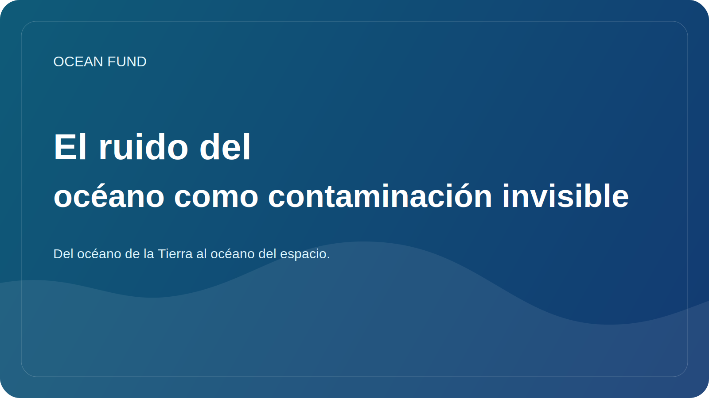

# El ruido del océano como contaminación invisible

Cuando se trata de contaminación de los océanos, la gente primero piensa en el plástico, el petróleo, las aguas residuales o los productos químicos. Pero hay otro tipo de contaminación cerca del océano que es más difícil de ver en las fotografías y, por tanto, más fácil de subestimar. Es ruido.

Para los humanos, el océano puede parecer un entorno grande y silencioso, pero para muchos organismos marinos el sonido es uno de los canales más importantes para percibir el mundo. A través del sonido, los animales navegan, buscan pareja, se comunican, encuentran comida y reconocen el peligro. Por tanto, el aumento del ruido antropogénico cambia no sólo el “fondo”, sino también las condiciones mismas de existencia de la vida marina.

Hay muchas fuentes de ruido: transporte marítimo, construcción, estudios sísmicos, actividad militar, infraestructura industrial. Sus efectos pueden variar desde estrés a corto plazo hasta alteraciones a largo plazo en el comportamiento y la migración. Particularmente sensibles son las especies para las cuales el entorno acústico desempeña un papel clave.

El problema del ruido del océano también es importante porque no encaja bien con la intuición ecológica habitual. El plástico se puede mostrar en tus manos. Se puede fotografiar una mancha de petróleo. La contaminación acústica requiere un lenguaje diferente: gráficos, conjuntos de datos de hidrófonos, explicaciones, mapas de envío y comunicación científica paciente.

Por eso el tema del ruido muestra bien por qué la sociedad necesita datos abiertos y una traducción científica de alta calidad. Sin ellos, la conversación fácilmente deriva en ignorar completamente el problema o en declaraciones duras pero poco fundamentadas. Mientras tanto, el ruido es un factor oceánico real que requiere seguimiento, políticas y comprensión pública.

Para el Fondo Oceánico, el tema del ruido del océano es interesante como ejemplo del “océano invisible”, esos procesos que son importantes desde el punto de vista ecológico, pero que apenas están representados en la imaginación popular. Trabajar con estos temas es especialmente valioso: amplían la comprensión pública del océano y muestran que su vulnerabilidad puede no siempre parecer dramática en la imagen, pero eso no la hace menos grave.
