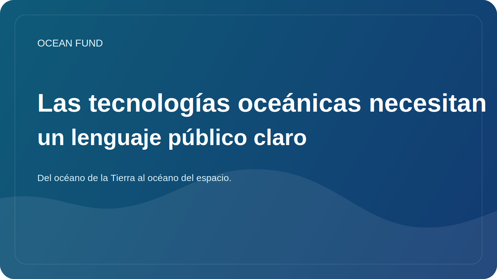

# Las tecnologías oceánicas necesitan un lenguaje público claro

La tecnología oceánica se está desarrollando rápidamente. Plataformas autónomas, servicios satelitales, sensores submarinos, sistemas acústicos, cartografía batimétrica, robótica marina, plataformas de datos y nuevas herramientas analíticas amplían constantemente nuestra capacidad para observar y trabajar con el océano. Pero la comprensión pública de esta capa va a la zaga.

A menudo, la capa tecnológica se presenta como algo demasiado limitado y de ingeniería, o como una excusa para una narración demasiado optimista. En el primer caso, el tema permanece cerrado a una amplia audiencia. En el segundo, las tecnologías se convierten en un conjunto de promesas no asociadas a restricciones, costos, riesgos y calidad de la evidencia.

Se necesita un lenguaje público claro precisamente para evitar ambas distorsiones. No debería simplificar las tecnologías hasta el punto de dejarlas sin sentido, pero tampoco debería dejarlas dentro de la jerga profesional. Es importante que la sociedad comprenda qué mide el sensor, cómo funciona la plataforma de observación, qué significa la calidad de los datos, por qué es necesaria la calibración y por qué hacerlo.

Esto es importante no sólo para la educación. Sin ese lenguaje, es difícil construir asociaciones entre ingenieros, museos, fundaciones, universidades, organizadores de eventos y actores políticos. Cada uno de ellos escucha la misma tecnología de manera diferente. Si no existe una capa de traducción común, la colaboración se estanca rápidamente.

Para el Ocean Fund, la tecnología oceánica no es una rama separada “para ingenieros”. Es parte de la infraestructura pública general del conocimiento. Necesitamos un lenguaje que conecte la instrumentación, la observación satelital, el análisis de datos, la educación, las exhibiciones y la narrativa del océano al espacio. Sólo entonces la tecnología dejará de ser una caja negra y pasará a formar parte de una conversación pública comprensible.

El futuro de la agenda oceánica depende en gran medida de si la sociedad puede hablar de tecnología sin exageraciones ingenuas y sin alienación. Crear un lenguaje así ya es un trabajo independiente. Y para proyectos como el Fondo Oceánico, debería integrarse en la estructura misma de los materiales públicos.
