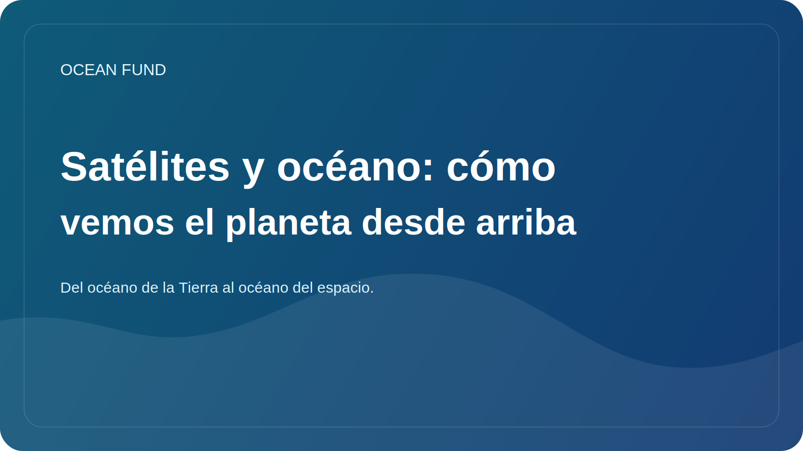

# Satélites y océano: cómo vemos el planeta desde arriba

La comprensión moderna del océano es imposible sin satélites. Si antes muchas ideas sobre el medio marino se basaban en expediciones, boyas y mediciones costeras, hoy la observación de la Tierra desde el espacio juega un papel muy importante. Esto es lo que nos da escala, comparabilidad y la capacidad de ver grandes procesos espaciales casi en tiempo real.

Los satélites permiten observar la temperatura de la superficie del mar, el color del océano, la distribución del hielo, la altura de la superficie, los grandes patrones de corrientes, la turbidez, la proliferación de fitoplancton y muchas otras características. Esto no hace que las mediciones tradicionales sean innecesarias, sino que las mejora radicalmente, permitiendo que las observaciones locales se vinculen con la imagen global.

Esta conexión es especialmente importante para el clima, la sostenibilidad costera y el trabajo educativo. Cuando vemos el océano desde arriba, queda más claro que no es una “masa azul” estática, sino un sistema dinámico con frentes, remolinos, ciclos estacionales, oleadas biológicas y grandes patrones climáticos. La observación espacial cambia la escala misma de nuestra percepción del océano.

Pero también en este caso es necesario tener precaución. Una imagen de satélite no es una “fotografía directa de la verdad”, sino el resultado de un procesamiento, modelos, calibración e interpretación complejos. Por lo tanto, el trabajo público con datos satelitales requiere buenas fuentes, descargos de responsabilidad claros y explicaciones claras de las limitaciones. De lo contrario, una imagen bella puede dar lugar a conclusiones incorrectas.

Para el Fondo Oceánico, la capa satelital es especialmente importante porque une naturalmente los océanos de la Tierra con los océanos del espacio. Estudiamos el medio marino a través de instrumentos fuera de la atmósfera. Esto crea un poderoso puente educativo e intelectual entre la oceanografía, la observación de la Tierra, las misiones espaciales y la exploración a largo plazo.

Éste es uno de los puntos fuertes del tema oceánico: ayuda a hablar de la Tierra como un sistema que entendemos mejor precisamente cuando somos capaces de mirarla tanto desde dentro como desde arriba. Los satélites hacen posible esta vista. Y la tarea de plataformas públicas como el Fondo Oceánico es traducirlo a un lenguaje que sea comprensible, claro y útil para la sociedad.
