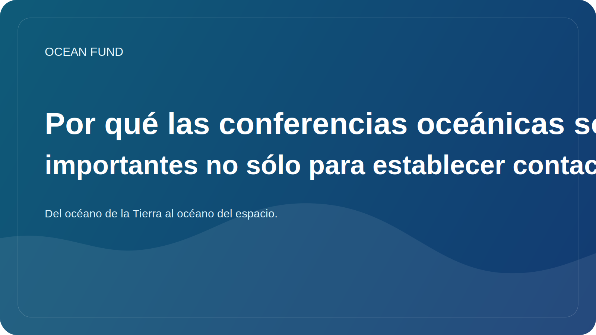

# Por qué las conferencias oceánicas son importantes no sólo para establecer contactos

Las conferencias sobre océanos a menudo parecen al observador externo una mezcla de charlas, paneles, stands y reuniones de negocios. De esta forma, pueden parecer un ritual de una comunidad profesional. Pero, en realidad, los buenos eventos oceánicos desempeñan un papel mucho más importante: ayudan a conectar la investigación, las políticas, los datos, la educación, la tecnología y la comunicación pública.

La agenda oceánica es demasiado compleja para vivir dentro de una sola disciplina. El biólogo marino, el analista de satélites, el curador de museos, el planificador costero, el desarrollador de sensores, el financiador filantrópico y el organizador de programas educativos rara vez trabajan en el mismo circuito diario. Las conferencias y foros se convierten en lugares donde estos lenguajes dispares se unen al menos temporalmente.

Por eso, un espacio para eventos de alta calidad no sólo es importante para establecer contactos. Es necesario para la transferencia entre capas. El resultado científico debe contar con comunicación pública. La plataforma de datos debe reunirse con el educador o el equipo del museo. La discusión sobre políticas debería escuchar la ciencia de los ecosistemas, y el optimismo tecnológico debería escuchar las limitaciones y los riesgos.

Para el Ocean Fund, esta capa es especialmente importante. El proyecto se está construyendo como una infraestructura abierta, no como un grupo de investigación cerrado. Esto significa que necesitamos eventos no sólo como un lugar para la autopresentación, sino también como un campo para el reconocimiento, la prueba del lenguaje, la búsqueda de socios, la comparación de temas y la transformación de ideas en materiales concretos: resúmenes, folletos de una página, tarjetas de datos, talleres y paquetes públicos.

Hay otra razón para tomar en serio los acontecimientos oceánicos. Determinan cómo la sociedad escuchará el tema de los océanos en los próximos años. Si el escenario está dominado sólo por lemas ruidosos, exageraciones o promesas vagas, entonces la agenda pública se debilita. Si el evento está conectado con datos, metodología, responsabilidad del ecosistema y una buena traducción de la ciencia, realmente hace avanzar el campo.

Por lo tanto, las conferencias, exposiciones y foros oceánicos no son una capa de “comunicación” secundaria. Es parte de la infraestructura misma del conocimiento oceánico. Y cuanto mejor aprendamos a utilizar estos espacios, más fuerte será la conexión entre el océano, la sociedad y las soluciones futuras.
