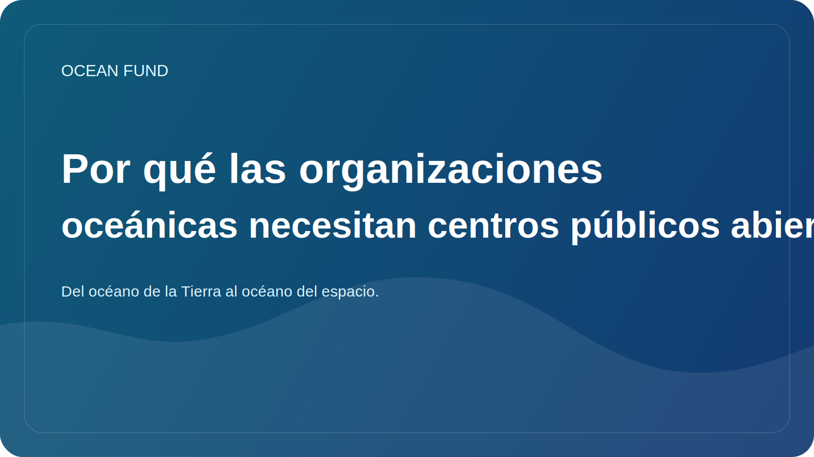

# Por qué las organizaciones oceánicas necesitan centros públicos abiertos

Muchas organizaciones oceánicas producen materiales útiles: estudios, presentaciones, mapas, resúmenes de políticas, programas de eventos, textos educativos, cartas, conjuntos de datos y visualizaciones. Pero con demasiada frecuencia estos materiales viven en sistemas dispares. Hay algo en el correo, algo en las carpetas de la nube, algo en el sitio web, algo en las carpetas personales del equipo y algo desaparece una vez completado el proyecto.

El problema aquí no es sólo la incomodidad. La fragmentación debilita la presencia pública misma de una organización. A alguien externo le resulta difícil entender qué tipo de proyecto es, qué representa, cómo participar, qué materiales ya existen y cómo distinguir un borrador de un resultado listo para el público.

Un centro público abierto resuelve este problema no mediante un hermoso diseño, sino mediante una arquitectura clara. Debe recopilar la misión, las direcciones de la investigación, las fuentes de datos, los paquetes de eventos, los folletos informativos, las notas de gobernanza, la cola de problemas y las rutas de participación en un solo lugar. Entonces el proyecto deja de depender de la memoria de personas individuales y comienza a funcionar como un sistema.

Esto es especialmente importante para la agenda oceánica. Hay demasiada intersección entre ciencia, datos, educación, tecnología y asociaciones. Si una organización no tiene un núcleo público estable, cada nueva comunicación comienza casi desde cero. El equipo gasta energía repitiendo explicaciones básicas en lugar de desarrollar el campo.

En esta lógica, GitHub es interesante no sólo como lugar para el código. Puede actuar como una memoria operativa abierta: un espacio donde se interconectan documentos, artículos, cuestiones, debates, registros de datos y materiales para los socios. Este enfoque mejora la confianza porque muestra la estructura, el estado de los materiales y la dirección del movimiento.

Para Ocean Fund, un centro abierto no es una herramienta secundaria, sino una de las principales formas de existencia del proyecto. Si una organización oceánica quiere ser comprensible, verificable y preparada para la colaboración, no necesita sólo un sitio web ni una carpeta de archivos, sino un sistema público vivo. Esto es lo que hace que un centro abierto sea un activo estratégico más que un detalle técnico.
