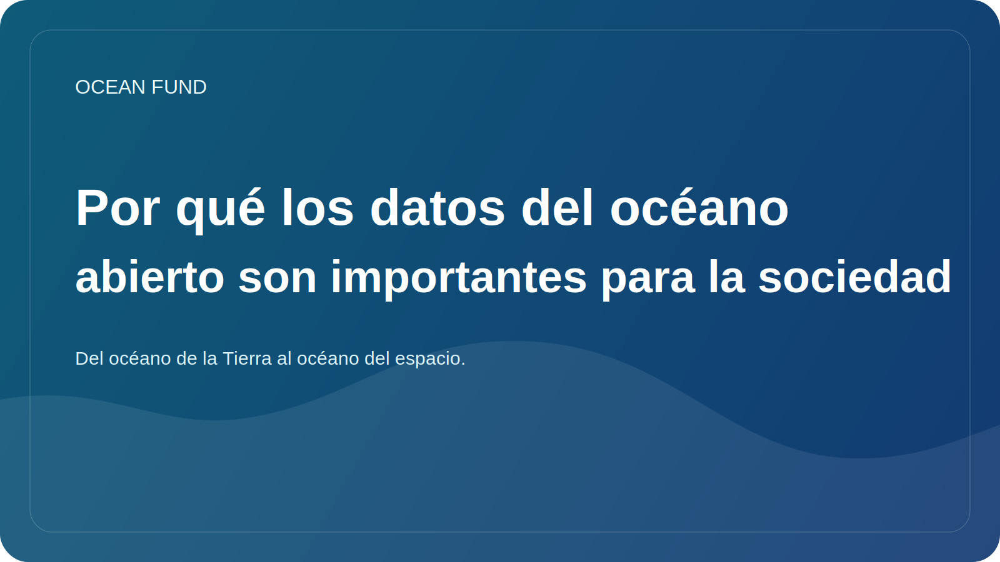

# Por qué los datos del océano abierto son importantes para la sociedad

Hoy en día, hablar del océano es imposible sin datos. La temperatura de la superficie del mar, la salinidad, la batimetría, las observaciones satelitales, la distribución de especies, la salud de los corales, el hielo marino, la contaminación y los riesgos costeros se describen cada vez más no sólo con palabras sino también con mediciones. Sin embargo, los datos por sí solos no crean un beneficio público.

Los datos en mar abierto son importantes porque permiten que diferentes grupos trabajen en la misma realidad. Un investigador ve material científico, un profesor obtiene la base para una lección, un museo puede crear una historia visual, un periodista puede comprobar una afirmación y un desarrollador puede crear una herramienta o un mapa. Cuando el acceso a los datos está abierto, la agenda oceánica deja de ser un club profesional cerrado.

Pero apertura no equivale a comprensibilidad automática. Incluso los datos buenos a menudo siguen siendo difíciles de utilizar externamente. Un conjunto puede tener una licencia compleja, restricciones no obvias, un formato técnico incomprensible para un no especialista o metadatos que requieren una traducción separada al lenguaje humano. Entonces, entre “los datos existen” y “la sociedad puede usarlos” hay mucho trabajo de interpretación.

Aquí es donde las tarjetas de conjuntos de datos, los registros de fuentes, los glosarios, los cuadernos, las tarjetas de demostración y los resúmenes claros y orientados al público son especialmente importantes. No reemplazan a la ciencia, sino que crean un puente entre un especialista y una audiencia externa. Un puente así es necesario no sólo para la educación. También es necesario para una conversación más responsable sobre riesgos, infraestructura, clima, política costera y conservación.

Los datos abiertos también reducen la dependencia de afirmaciones sofisticadas pero vacías. Si un proyecto habla sobre el océano, la protección de los océanos, el seguimiento o la economía azul, debe haber una manera de comprobar en qué se basa la redacción. Tener una fuente abierta, fecha de acceso, descripción de restricciones y estado de verificación hace que el discurso público sea más fuerte y honesto.

Para el Ocean Fund, los datos en alta mar son más que un simple recurso técnico. Esta es la base de la confianza pública, el trabajo educativo y la cooperación internacional. A través de datos abiertos se pueden crear mapas, conferencias, resúmenes, materiales para eventos, propuestas de asociación y preguntas de investigación. Ayudan a conectar las ciencias oceánicas con la sociedad sin perder rigor.

En el futuro, la importancia de esta capa no hará más que crecer. A medida que haya más misiones satelitales, redes de sensores, plataformas submarinas y programas de observación global disponibles, la infraestructura que evita que nos ahoguemos en la avalancha de información se volverá más importante. La sociedad no sólo necesita portales de datos, sino también sistemas de navegación claros basados ​​en datos oceánicos. La creación de tales sistemas ya no es una tarea secundaria, sino parte de la cultura oceánica moderna.
