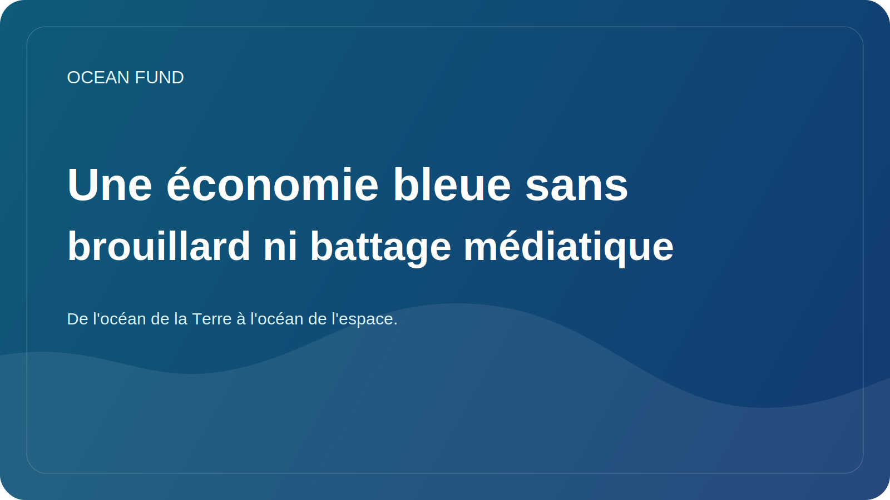

# Une économie bleue sans brouillard ni battage médiatique

Le terme « économie bleue » est devenu très populaire. Il est utilisé par les gouvernements, les investisseurs, les entreprises technologiques, les ONG, les organisations internationales et les organisateurs de forums. Mais plus ce langage est utilisé, plus il risque de devenir une belle coquille qui cache des pratiques trop différentes et parfois contradictoires.

Au sens strict, une économie bleue devrait signifier une collaboration avec l’océan qui relie l’activité économique à la conservation des écosystèmes, à la rigueur scientifique, à la durabilité à long terme et à une répartition équitable des bénéfices. Cela peut inclure la pêche durable, l’aquaculture, les services de données marines, la surveillance, l’adaptation côtière, les technologies vertes, l’éducation et les mécanismes financiers qui ne détruisent pas la base même de la vie océanique.

Mais dans la pratique, on tente parfois d’inclure presque toutes les activités maritimes dans l’économie bleue, même si ses conséquences environnementales et sociales sont mal comprises. C’est pourquoi il est important pour Ocean Fund de travailler sur ce sujet sans battage publicitaire. Ce qu’il faut, ce ne sont pas des slogans généraux, mais des questions claires : quelles données étayent les bénéfices allégués ? Comment les risques sont-ils pris en compte ? qui gagne ? qui supporte les frais ? Comment le résultat est-il mesuré ?

Cette approche est utile à la fois pour les partenariats et pour la communication publique. Cela permet de distinguer la véritable durabilité du battage publicitaire. Dans l’espace océanique, cela est particulièrement important car de nombreuses solutions semblent innovantes et belles, mais leurs effets à long terme peuvent être ambigus ou sous-testés.

Un langage sain pour une économie bleue doit inclure des contraintes, et pas seulement des opportunités. Il faut reconnaître que l’océan n’est pas un réservoir inépuisable de ressources, mais un système vivant complexe. Et si l’économie veut rester véritablement « bleue », elle devra apprendre à travailler non pas contre cette complexité, mais au sein d’elle.

Pour Ocean Fund, le thème de l’économie bleue n’est pas une manière d’ajouter un mot à la mode au discours public. C’est l’occasion d’engager une conversation plus précise sur l’avenir de l’océan, qui inclut la technologie, les données, la finance et la responsabilité écosystémique. Sans un tel lien, le concept perd rapidement son sens. Avec lui, il peut devenir l’un des cadres importants du 21e siècle.
