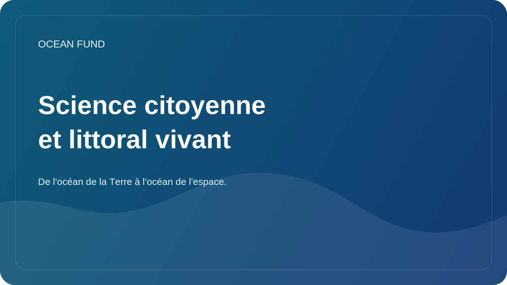

# Science citoyenne et littoral vivant

Le littoral apparaît souvent comme une frontière évidente entre terre et mer. Mais en réalité, c’est l’une des régions les plus dynamiques, les plus sensibles et les plus en évolution rapide de la planète. C’est là que convergent les processus naturels, les infrastructures, le tourisme, l’écologie, l’économie locale et la vie quotidienne des communautés. C’est pourquoi la côte est si importante pour la science citoyenne.

La science citoyenne est utile non pas lorsqu'elle remplace la science, mais lorsqu'elle élargit la capacité d'observation de la société. Les observations volontaires, les enregistrements photographiques, les protocoles de déchets, l'érosion côtière, les observations de biodiversité ou les indicateurs de qualité peuvent créer une couche importante de données, surtout s'ils sont associés à une méthodologie claire et au respect des limites.

L’avantage du thème du littoral vivant est qu’il ramène l’agenda océanique à la réalité. Il est plus facile pour une personne de constater les changements sur les plages, les algues, les déchets, les infrastructures côtières ou les fluctuations saisonnières de l’eau que le système océan-climat abstrait dans son ensemble. Grâce à l’observation locale, la société accède à la conversation océanique plus large.

Mais la science citoyenne requiert de la prudence. Toutes les collectes de données ne sont pas utiles. Nous avons besoin de protocoles clairs, d’une compréhension de ce qui est exactement mesuré, de la manière dont les informations sont stockées, des biais qui existent et de ce qui ne peut pas être fait avec des données personnelles ou sensibles. Sans cette discipline, l’initiative peut facilement se transformer en bruit.

Pour le Fonds Océan, la science citoyenne est intéressante en tant que pont entre l’engagement du public et la culture des données. Il ne s’agit pas simplement d’une « activité bénévole », mais d’une opportunité de construire une infrastructure publique de protection de l’océan. Grâce à lui, vous pouvez connecter des écoles, des ONG, des musées, des communautés côtières et des pratiques de données ouvertes.

Un littoral vivant est une bonne image pour cette œuvre. Elle est en constante évolution, en réponse au climat, à l’activité économique et aux processus écosystémiques. Et si la société apprend à observer de plus près cette frontière vivante, elle commence à mieux comprendre à la fois l’océan lui-même et le rôle qu’il joue à ses côtés.
