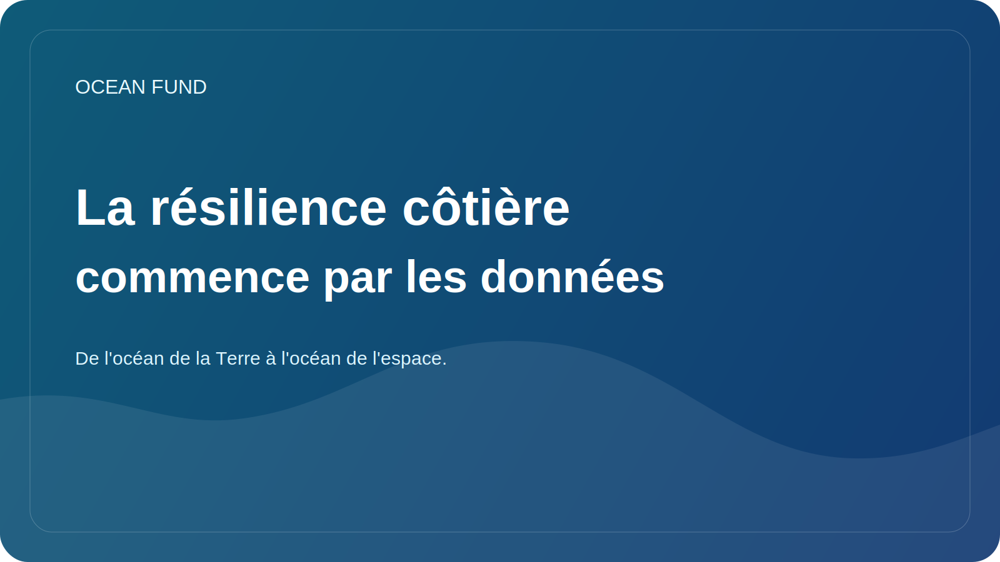

# La résilience côtière commence par les données

Lorsque les gens parlent de résilience côtière, ils pensent généralement aux tempêtes, à l’érosion, à l’élévation du niveau de la mer, aux infrastructures et aux risques pour les villes. Mais la résilience côtière ne commence pas par des structures concrètes ou des manchettes alarmantes. Cela commence par la façon dont nous voyons et comprenons ce qui se passe.

Les côtes sont des zones à forte dynamique. Ici se rencontrent la terre, la mer, les processus atmosphériques, les systèmes fluviaux, les transports, le tourisme, l’écologie et la vie urbaine. Même de petits changements dans la configuration des vagues, les précipitations, le transport des sédiments, la température de l’eau ou les modèles de développement peuvent progressivement modifier la stabilité de l’ensemble d’un système côtier.

Sans données, cette complexité se transforme rapidement en un chaos d’interprétations. Certains ne voient que le climat, d’autres uniquement les infrastructures, d’autres encore uniquement la pollution locale. Mais une solution durable nécessite de combiner plusieurs couches : observations satellitaires, bathymétrie, mesures côtières, séries chronologiques historiques, cartes d’utilisation des terres, observations biologiques et connaissances locales des communautés.

Les autorités et les chercheurs ne sont pas les seuls à avoir besoin de données côtières de qualité. Ils sont également importants pour la participation du public. Si les gens disposent de cartes claires, de séries chronologiques, de visualisations des changements et de documents explicatifs soignés, la conversation sur la côte devient moins abstraite. Il y a de la place pour des décisions raisonnables, et pas seulement pour une réaction émotionnelle face à la prochaine urgence.

Les outils ouverts et reproductibles sont ici particulièrement importants. La résilience côtière bénéficie des cartes, des fiches d’ensembles de données, des protocoles d’observation, de la science citoyenne et des synthèses de données publiques. Ils rendent le sujet plus accessible aux écoles, aux musées, aux organisations locales, aux journalistes et aux lieux événementiels.

Pour le Fonds Océan, les côtes sont le lieu où la thématique océanique rencontre directement la vie de la société. C’est là que l’on voit clairement que les données ne sont pas un luxe technique, mais font partie de l’infrastructure civile et environnementale. Si nous voulons parler sérieusement de résilience, nous devons également parler d’accessibilité, de qualité et de traduction des données en solutions publiques compréhensibles.
