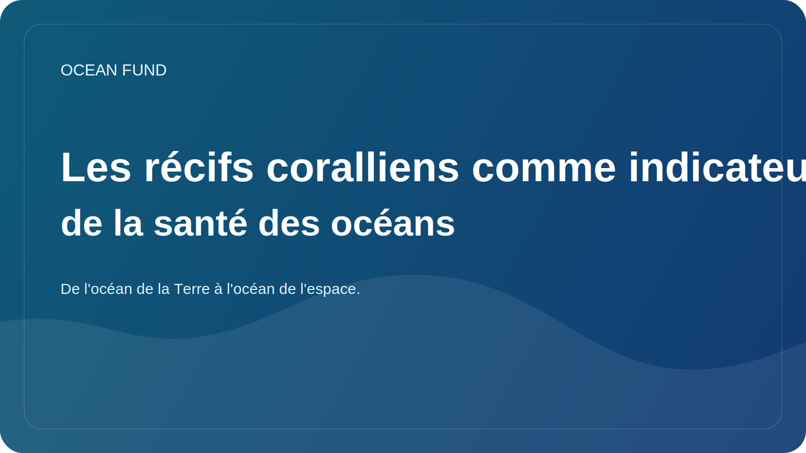

# Les récifs coralliens comme indicateur de la santé des océans

Les récifs coralliens sont souvent perçus comme de magnifiques exotiques, dignes des cartes postales, des films et des brochures de voyage. Mais d’un point de vue scientifique et social, les récifs sont bien plus importants. Ils constituent un indicateur sensible des conditions océaniques et l’un des signaux les plus clairs de la rapidité avec laquelle l’environnement marin évolue.

Les récifs sont extrêmement riches en vie. Dans une zone relativement petite, ils abritent une grande diversité d’organismes : poissons, invertébrés, algues, communautés microbiennes et une variété de formes de vie interconnectées. Par conséquent, la dégradation des récifs signifie non seulement la perte d’un paysage particulier, mais également la destruction d’une architecture écosystémique complexe.

Il est particulièrement important que les récifs soient très sensibles à la surchauffe de l'eau. Les vagues de chaleur marines, les changements chimiques dans les océans, la pollution locale, les perturbations mécaniques et l’utilisation non durable des côtes affectent rapidement la santé des coraux. Lorsque nous constatons un blanchissement ou un affaiblissement massif des récifs, il ne s’agit pas d’un « problème » local mais d’un élément d’un schéma plus large de stress océanique.

Dans le même temps, les récifs ont une signification non seulement naturelle, mais aussi sociale. Ils concernent la pêche, le tourisme, la protection des côtes et la résilience des communautés locales. Pour de nombreuses régions, le récif est à la fois un cadre de vie, une source de revenus, une réalité culturelle et une barrière naturelle qui amortit les effets des vagues et des tempêtes.

Parler des récifs est également utile car cela rend le sujet de l’océan plus clair pour un public plus large. Les récifs peuvent expliquer le climat, la biodiversité, l’acidité des océans, les zones marines protégées, les observations par satellite et la nécessité d’une surveillance à long terme. C’est l’un de ces sujets où l’exactitude scientifique et la communication publique peuvent se renforcer mutuellement.

Pour le Fonds Océan, le thème des coraux est important dans le cadre d’une question plus vaste : comment traduire les changements océaniques complexes dans un langage compréhensible pour le public sans perdre en rigueur scientifique. Les récifs constituent un point d’entrée puissant dans cette conversation car ils sont à la fois beaux, vulnérables, révélateurs et profondément liés à l’avenir de l’océan.
