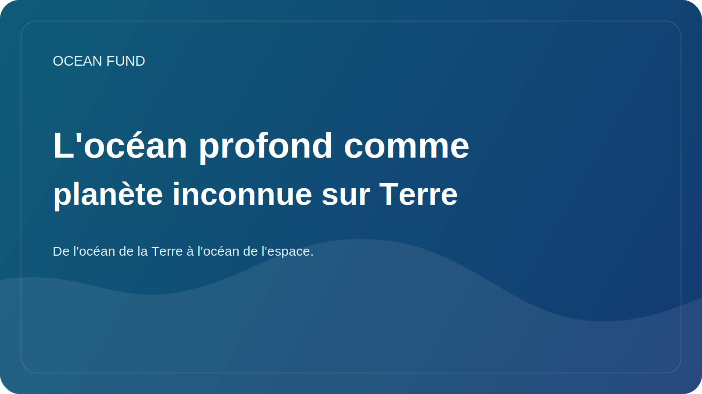

# L'océan profond comme planète inconnue sur Terre

Il est courant de parler des profondeurs océaniques comme de quelque chose de lointain, sombre et presque inaccessible. Il y a du vrai dans cette affirmation, mais il existe aussi une formule plus précise : les profondeurs océaniques sont l’un des plus grands environnements sous-explorés de notre propre planète.

À de grandes profondeurs, la pression, la température, la lumière et la disponibilité énergétique changent. Il existe des écosystèmes adaptés à des conditions qui ont longtemps semblé presque incompatibles avec la vie active. Les sources hydrothermales, les plaines sous-marines, les monts sous-marins et les zones de fracture montrent à quel point notre vision intuitive de l'habitabilité peut être limitée.

C’est pourquoi les profondeurs océaniques sont si importantes non seulement pour l’océanographie, mais aussi pour la science au sens large. Il permet de poser des questions sur les origines et les limites de la vie, les cycles biogéochimiques, le rôle des écosystèmes mal compris dans la résilience des océans et la manière dont l'humanité devrait se comporter dans un environnement qu'elle ne comprend encore que de manière fragmentaire.

Aujourd’hui, les profondeurs océaniques sont de plus en plus au centre des discussions économiques et politiques. L’exploitation minière sous-marine, la cartographie des fonds marins, les applications militaires et industrielles, les nouveaux systèmes autonomes et l’expansion des infrastructures d’observation suscitent un intérêt croissant. Mais c’est à ce moment-là qu’il est particulièrement important de ne pas remplacer la connaissance par la passion technologique.

Les profondeurs océaniques nécessitent la discipline de l’incertitude. Nous devons reconnaître que la carte est incomplète, que les écosystèmes ne sont que partiellement décrits et que les effets des interventions peuvent être lents et peu évidents. En ce sens, le thème des grands fonds marins est également utile à la pensée sociale : il rappelle que le progrès ne doit pas signifier l’exploitation automatique d’un quelconque environnement disponible.

Pour l’Ocean Fund, les profondeurs océaniques sont importantes en tant que pont intellectuel entre l’exploration de la Terre et l’imagination d’autres mondes. Si nous ne comprenons pas pleinement nos propres profondeurs, il est d’autant plus intéressant d’être attentif aux histoires sur les océans sous-glaciaires d’Europe ou d’Encelade. Les profondeurs océaniques de la Terre constituent à la fois une frontière scientifique et une école de modestie épistémique.
