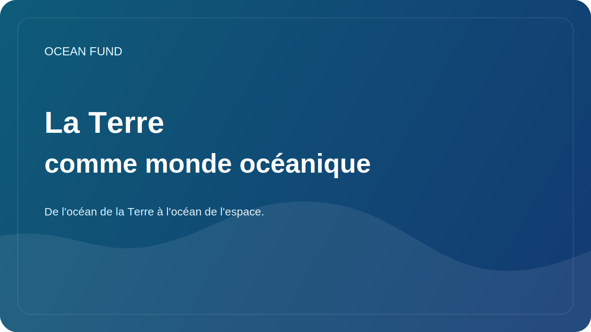

# La Terre comme monde océanique

L'idée de « mondes océaniques » est généralement associée à l'espace. Europe, Encelade, Titan et d'autres objets du système solaire intéressent les scientifiques car d'énormes volumes d'eau peuvent exister sous leurs coquilles glacées ou dans des environnements complexes. À travers ce sujet, la science pose l’une des questions les plus profondes : où d’autre les conditions de vie sont-elles possibles ?

Mais pour vraiment comprendre les mondes océaniques, il est utile de commencer par considérer la Terre comme un monde océanique. Sur notre planète, l’océan couvre la majeure partie de la surface, régule le climat, relie les continents, façonne les cycles mondiaux de la matière et de l’énergie et crée les conditions d’une étonnante diversité de vie. La Terre n’est pas seulement une « planète avec un océan ». À bien des égards, c'est une planète océanique.

Cette perspective change à la fois le débat éducatif et scientifique. Lorsque nous considérons la Terre comme un monde océanique, l’océanographie cesse d’être une simple discipline régionale portant sur les côtes, les courants et les profondeurs. Cela s’inscrit dans une question beaucoup plus vaste sur la manière dont l’eau, l’énergie, la chimie, la géologie et la biologie s’unissent pour former un système capable de soutenir la vie.

Le pont entre l’océanologie et les observations spatiales est ici particulièrement important. Les satellites nous aident à observer la température, la couleur de l’océan, la glace, la hauteur de la surface de la mer, les grands schémas de circulation et les changements côtiers. Dans le même temps, les recherches sur les lunes glacées, les océans sous-glaciaires et l’astrobiologie soulèvent de nouvelles questions sur Terre. Quels environnements extrêmes de notre planète peuvent servir d’analogues ? Que nous enseignent les profondeurs océaniques sur la vie dans l’obscurité, sous pression et dans des systèmes à énergie limitée ? Comment la société peut-elle mieux comprendre l’océan s’il est considéré à la fois comme le foyer de la vie et comme un modèle scientifique pour d’autres mondes ?

Pour le Fonds Océan, la formule « de l’océan de la Terre à l’océan de l’espace » est pour cette raison importante. Cela n’éloigne pas la conversation de la Terre, mais au contraire, cela la renforce. Cela permet de montrer que le thème de l’océan ne concerne pas seulement l’écologie et le climat, mais aussi l’imagination, l’exploration, la technologie d’observation et la compréhension à long terme de l’habitabilité.

Ce langage est particulièrement utile pour les musées, les planétariums, les festivals scientifiques, les programmes éducatifs et les événements interdisciplinaires. Il relie l’océan, les données, les satellites, la biologie, le climat et l’espace en une seule histoire compréhensible. Et si cette histoire est racontée avec soin, sans sensationnalisme et sans brouillard pseudo-scientifique, elle peut être un moyen puissant d’impliquer de nouvelles personnes dans l’agenda océanique.

La Terre nous donne déjà accès au monde océanique dans lequel nous vivons. La comprendre plus profondément, c’est simultanément mieux comprendre à la fois notre propre planète et les horizons d’exploration future au-delà d’elle.
