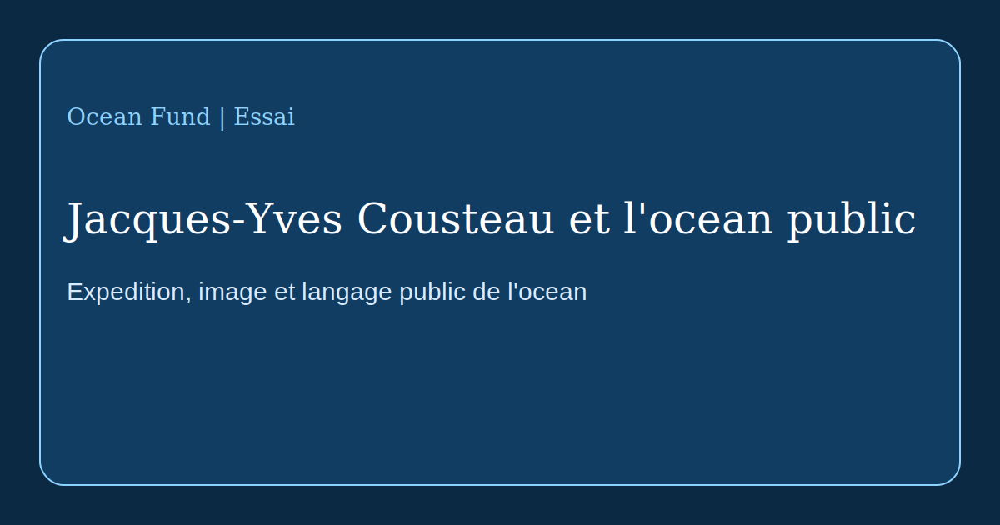

# Jacques-Yves Cousteau et l'ocean public

Jacques-Yves Cousteau compte non seulement comme explorateur de la mer, inventeur ou cineaste, mais aussi comme l'une des figures qui ont fait passer l'ocean d'un domaine professionnel ferme a l'imaginaire public mondial. Avant Cousteau, l'ocean etait souvent percu soit comme decor romantique, soit comme espace militaire, halieutique ou scientifique. Avec Cousteau, il devient aussi une scene publique de connaissance, d'alerte, de beaute et de responsabilite.

L'histoire officielle de la [Cousteau Society](https://www.cousteau.org/know/vessels/calypso/) montre que la Calypso n'etait pas seulement un navire. C'etait un laboratoire flottant, un studio de tournage, une base d'expedition et une plateforme d'invention. Par elle, Cousteau reliait voyage, image, technique et recit. Cette combinaison fut l'une de ses grandes contributions. Il n'a pas seulement plonge et enquete. Il a construit un langage permettant a la societe de voir le monde sous-marin comme une partie de son propre avenir.

Ce langage reposait sur plusieurs couches. D'abord la technique: le scaphandre autonome, les cameras sous-marines, des submersibles comme la celebre [Diving Saucer](https://www.cousteau.org/know/inventions/diving-saucer/), les chambres d'observation, le turbosail et de nouvelles formes de mobilite oceanique. Ensuite l'itineraire: la Mediterranee, la mer Rouge, l'Amazonie, l'Antarctique, le golfe Persique, la mer de Cortez, les atolls et les iles eloignees. Enfin la dramaturgie: Cousteau transformait l'expedition en recit public.

Selon la Cousteau Society, en 1977 l'equipe de la Calypso mena une etude sur la pollution de la Mediterranee dans 13 pays, et en 1985 elle lanca une expedition autour du monde a bord de Calypso et d'Alcyone. Ces projets sont importants non seulement comme episodes de l'histoire scientifique. Ils montrent qu'une expedition peut etre a la fois recherche, diplomatie, media et avertissement ecologique.

Pour Ocean Fund, la lecon est directe. Il ne suffit pas de collecter des donnees, de rediger des documents internes ou d'enumerer les problemes de l'ocean. Il faut une traduction publique: essais, cartes, textes d'exposition, parcours scolaires, conferences, recits visuels, pages partenaires et materiaux multilingues qui rendent l'ocean lisible et proche. Cousteau ne remplace pas la science contemporaine, mais il rappelle qu'entre la recherche et la societe il faut toujours un medium.

Il faut aussi etudier Cousteau non comme une icone sans defaut, mais comme un modele de mediation oceanique publique. Nous avons aujourd'hui d'autres normes eth iques, d'autres capacites techniques et une autre echelle de menace ecologique. Mais la tache reste la meme: faire de l'ocean non pas une abstraction, mais une partie visible de la pensee collective.

Si Ocean Fund veut avancer selon la formule « De l'ocean de la Terre a l'ocean de l'espace », il lui faut ce niveau de langage public: non seulement la rigueur scientifique, mais aussi la capacite de construire des images, des trajectoires d'attention et un lien durable entre les personnes, les expeditions et l'eau planetaire.
