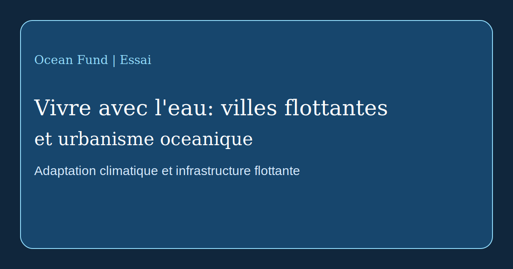

# Vivre avec l'eau: villes flottantes et urbanisme oceanique

Le theme des villes sur l'eau n'est plus une simple science-fiction, mais il reste situe a la frontiere entre l'experimentation, l'ingenierie, l'adaptation climatique et l'imaginaire politique. Il faut donc l'aborder sans brouillard euphorique et sans scepticisme automatique. L'infrastructure flottante existe deja sous plusieurs formes. La vraie question n'est plus de savoir si construire sur l'eau est possible, mais quel est le sens public de ces systemes et a qui ils profitent reellement.

D'un cote se trouvent les projets d'adaptation climatique et urbaine. [UN-Habitat](https://unhabitat.org/news/27-apr-2022/un-habitat-and-partners-unveil-oceanix-busan-the-worlds-first-prototype-floating), avec ses partenaires, a presente OCEANIX Busan comme un prototype d'extension urbaine flottante durable pour les villes cotieres confrontees a la montee des eaux, au manque de foncier et aux risques climatiques. Ici, il ne s'agit pas de fuir la terre, mais de chercher de nouvelles formes de developpement littoral.

D'un autre cote se trouvent des lignes plus radicales liees a l'autonomie, aux communautes marines et a la culture du seasteading. [The Seasteading Institute](https://www.seasteading.org/about/) presente clairement les communautes flottantes comme des espaces d'experimentation sociale, tandis que ses [active projects](https://www.seasteading.org/active-projects/) montrent un spectre plus large: mariculture, brise-lames, plateformes residentielles et infrastructures productives en mer. En parallele, des entreprises comme [Ocean Builders](https://oceanbuilders.com/about-us/) traduisent ce theme en design produit, habitat modulaire et vie au-dessus des vagues.

Entre ces poles existe une troisieme ligne: l'architecture adaptative sur l'eau. Des pratiques comme [Waterstudio](https://www.waterstudio.nl/built-on-water-floating-houses/) considèrent la construction flottante non comme une utopie isolee, mais comme une extension de l'urbanisme sous contraintes hydriques changeantes. Cette logique est plus proche non d'« une nouvelle civilisation en pleine mer », mais d'une reconfiguration progressive des rapports entre la ville, le rivage, l'infrastructure et l'inondation.

Pour Ocean Fund, plusieurs questions doivent etre tenues ensemble. Qui vivra sur l'eau? A quoi sert exactement le systeme flottant: luxe, adaptation climatique, recherche, tourisme, mariculture, logement temporaire ou experimentation publique? Comment sont traites les dechets, l'energie, l'eau douce, la maintenance, l'accessibilite, la securite et le regime juridique? Et comment ces reponses changent-elles entre eaux equatoriales, temperees et froides?

C'est pourquoi le seasteading et les villes flottantes meritent non des slogans, mais une veritable couche de recherche. Dans certains cas, ils peuvent devenir des outils utiles pour la resilience cotiere et de nouveaux types d'infrastructures oceaniques. Dans d'autres, ils peuvent n'etre qu'une vitrine couteuse, peu reliee au bien public. Entre ces extremes se situe le vrai travail: comparer les modeles, suivre les cas et evaluer les consequences techniques, ecologiques et sociales.

Pour Ocean Fund, ce theme compte non comme un sujet exotique, mais comme une partie d'une ligne plus large: apprendre a vivre avec l'eau. Si le XXIe siecle devient celui de la pression climatique sur les cotes, alors le langage de l'urbanisme oceanique sera necessaire non seulement aux architectes et aux investisseurs, mais aussi aux chercheurs, journalistes, musees, villes et plateformes d'interet public. Parler de l'avenir de l'ocean, c'est aussi parler des formes futures de vie sur l'eau.
