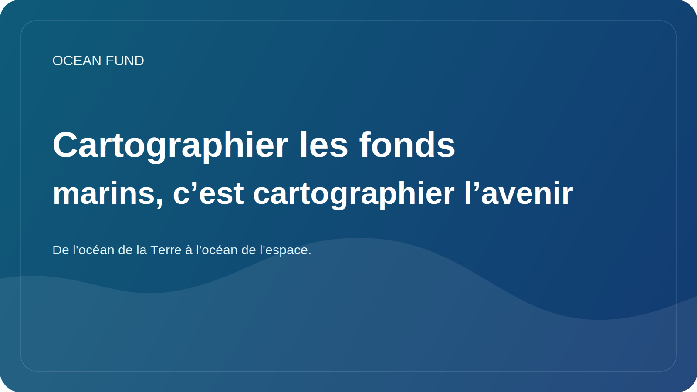

# Cartographier les fonds marins, c’est cartographier l’avenir

Sur terre, nous avons l’habitude de considérer une carte comme quelque chose de basique. Les cartes des villes, des routes, des rivières, des frontières et du terrain semblent presque évidentes. Mais lorsqu’il s’agit de l’océan, et notamment des fonds marins, la situation change. Une partie importante du relief sous-marin n'est toujours pas connue avec autant de détails que la science et la société modernes le souhaiteraient.

Il ne s’agit pas seulement d’un problème technique de cartographie. Les fonds marins sont importants pour comprendre la géologie, les écosystèmes, la circulation, les itinéraires de câbles et d'infrastructures, les risques associés aux glissements de terrain et aux tsunamis, ainsi que l'avenir des solutions en eaux profondes. Sans de bonnes cartes bathymétriques, il est difficile de parler de politique maritime à long terme et de travail responsable avec l'océan.

De plus, la cartographie du fond est symboliquement importante. Cela nous rappelle que sur notre propre planète, il reste une immense couche d’espace qui ne nous est pas encore suffisamment visible. À l’ère des satellites et des plateformes numériques, il est facile d’oublier à quel point le monde physique est encore incomplètement décrit.

Pour le Fonds Océan, la thématique des fonds marins est importante tant sur le plan scientifique que culturel. Cela nous permet de parler de l’océan comme d’une frontière non seulement dans un sens romantique, mais aussi dans un sens pratique : une frontière de données, d’observations, d’infrastructures et de connaissances. Grâce à la bathymétrie, il est pratique de relier la science, la technologie, la visualisation et l’imagination du public.

Il y a un autre aspect important. Lorsque nous cartographions le fond marin, nous cartographions en réalité l’espace des solutions futures. Quelles zones sont vulnérables ? Où sont les écosystèmes importants ? Où sont nos connaissances encore trop faibles ? Dans quels domaines la technologie peut-elle aider et où est-il nécessaire de faire preuve de plus de prudence ? La carte devient non seulement une image, mais une base de réflexion.

Par conséquent, travailler sur les fonds marins n’est pas l’affaire des seuls spécialistes. Il est également important que la société comprenne pourquoi le fond des océans n’est pas un « espace vide sous l’eau ». C'est l'une des plus grandes structures de notre planète. Et mieux nous le verrons, plus nous pourrons parler de manière responsable de l’avenir de l’océan.
