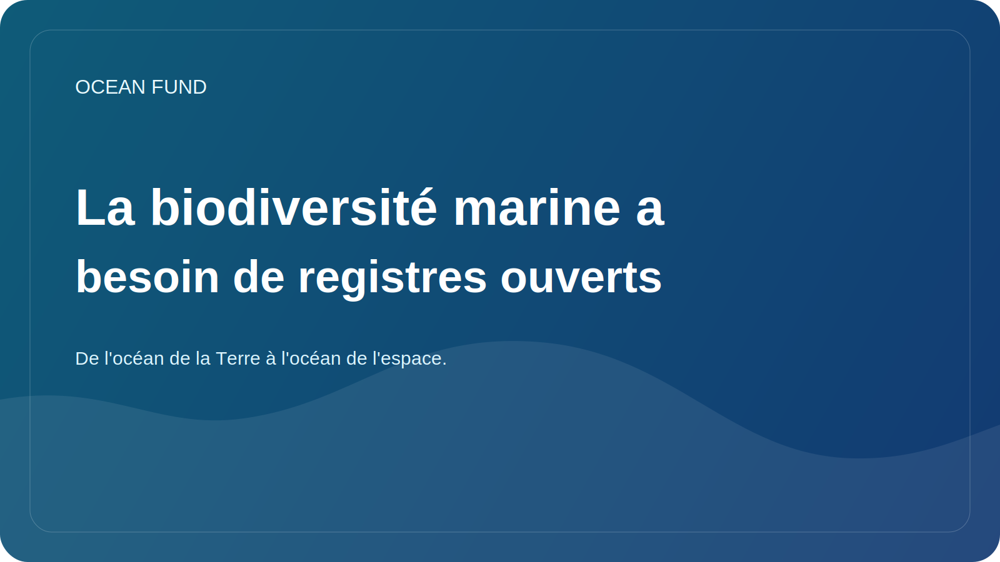

# La biodiversité marine a besoin de registres ouverts

La biodiversité marine est énorme, mais pas toujours clairement visible pour le public. Les gens connaissent peut-être les baleines, les coraux, les requins ou les tortues de mer, mais la structure réelle de la vie dans l’océan est beaucoup plus vaste et complexe. Un grand nombre d’organismes, d’écosystèmes et de relations restent hors de portée de la perception de masse.

C’est pourquoi les registres ouverts, les répertoires et les systèmes de données sur la biodiversité sont si importants. Ils offrent la possibilité non seulement de stocker des données, mais aussi de rendre visible la vie océanique dans un sens plus systémique. Grâce à de tels systèmes, il est possible de comprendre la répartition des espèces, les relations taxonomiques, les observations historiques, les lacunes dans les connaissances et les liens entre différents ensembles de données.

Pour la science, c’est l’infrastructure de base. Mais cela n’en est pas moins important pour la société. Si un journaliste, un éducateur, un conservateur de musée, un étudiant ou une équipe politique ne parvient pas à trouver rapidement un point de référence fiable sur la biodiversité, alors le débat sur la conservation s’affaiblit. Il s’appuie sur des exemples clairs isolés plutôt que sur une compréhension systémique.

Les registres ouverts aident également à lutter contre les deux extrêmes. D’une part, ils réduisent le chaos et la duplication. D’un autre côté, ils protègent contre la tentation de parler de la vie océanique en termes trop généraux et non opérationnels. Lorsqu’il existe un registre, un atlas ou un système de données liées, il devient possible de parler plus précisément.

Pour le Fonds Océan, cette couche est importante dans le cadre de l’infrastructure globale des données et des connaissances. Nous voulons relier la science, l’éducation, le récit public et le travail en partenariat. Sans registres ouverts de la biodiversité, ce pont sera incomplet. Ils vous permettent de créer des fiches d'ensembles de données, des cahiers pédagogiques, des visuels d'événements, des explications sur les espèces et des dossiers publics, qui ne sont pas basés sur des faits aléatoires, mais sur une base de connaissances stable.

La biodiversité marine a non seulement besoin de protection, mais aussi de visibilité. Les registres publics sont un moyen de donner cette forme de visibilité. Cela signifie qu’ils font partie non seulement de la culture des données, mais aussi de la culture de la responsabilité océanique.
