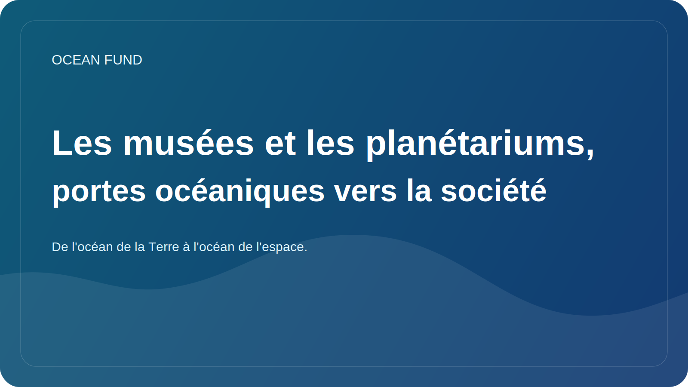

# Les musées et les planétariums, portes océaniques vers la société

La thématique océanique ne doit pas vivre uniquement dans les laboratoires, les rapports et les portails de données spécialisés. Pour que la société comprenne véritablement le rôle de l’océan, nous avons besoin d’espaces où les connaissances sont rendues visibles, émotionnellement accessibles et intellectuellement cohérentes. C’est pourquoi les musées, les centres scientifiques et les planétariums sont si importants pour l’agenda océanique.

Le musée sait faire ce que font rarement les documents secs : transformer un système complexe en une expérience vécue. Grâce à une exposition, une carte, une maquette, une vidéo, une station interactive ou un programme de conférences, une personne peut voir l’océan non pas comme une toile de fond abstraite de la planète, mais comme un environnement vivant lié au climat, à la biodiversité, aux données et à l’avenir des côtes.

Les planétariums ajoutent une autre dimension à cela. Ils contribuent naturellement à construire un pont entre l’océan terrestre et la perspective cosmique. À travers les observations satellitaires, l’observation de la Terre, les mondes océaniques et le thème de l’habitabilité, le planétarium peut montrer que parler de l’océan est à la fois une conversation sur notre planète et sur la question plus large de la vie dans l’Univers.

Un tel pont est particulièrement précieux car il rend la science plus large et plus intéressante sans perdre en rigueur. L'océanologie rencontre l'astrobiologie. Les données marines rencontrent les satellites. Le thème du climat rencontre l’imagination à long terme. Il s’agit d’un format très solide pour la science publique.

Pour le Fonds Océan, les musées et planétariums ne sont pas de simples partenaires potentiels pour des « activités pédagogiques ». Ce sont des institutions capables de transformer le discours public en une infrastructure culturelle durable. Grâce à eux, vous pouvez lancer des conférences, des modules d'exposition, des visualisations, des kits pédagogiques, des formats d'événements et des ponts interdisciplinaires entre l'océan, les données et l'espace.

Si la société veut réellement apprendre à considérer l’océan comme le système central de la vie sur Terre, elle a besoin de plus que de simples documents et tableaux de bord. Il lui faut une porte d’entrée culturelle. Et les musées dotés de planétariums constituent l’une des portes d’entrée les plus solides.
