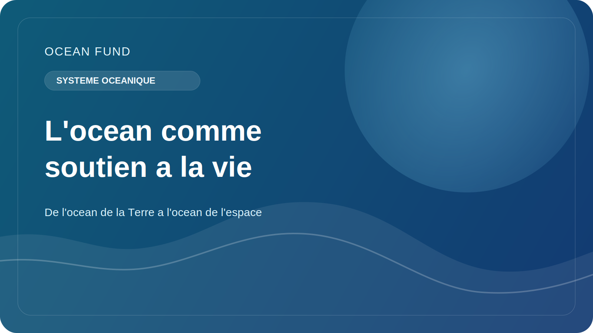

# L'océan comme système de survie sur Terre

Lorsque les gens parlent d’océan, ils pensent souvent à l’eau, aux côtes, aux tempêtes, aux poissons, aux navires ou à de belles photographies d’horizons bleus. Mais l’océan n’est pas seulement important en tant que paysage ou ressource. Il fonctionne comme l’un des principaux systèmes de survie sur Terre.

L'océan contribue à réguler le climat de la planète. Il absorbe une grande partie de la chaleur excédentaire provenant de l’augmentation des gaz à effet de serre dans l’atmosphère. Sans ce tampon, le changement climatique sur terre serait encore plus marqué et destructeur. L’océan participe également au cycle mondial du carbone, en séquestrant le carbone par des processus physiques, chimiques et biologiques.

Mais le rôle climatique de l’océan ne se limite pas aux chiffres des rapports scientifiques. Les conditions océaniques influencent les régimes de précipitations, la gravité des tempêtes, la résilience des écosystèmes côtiers et la qualité de vie dans les régions côtières. Par l’intermédiaire de l’atmosphère et des courants, l’océan est lié à l’agriculture, aux systèmes alimentaires, aux infrastructures urbaines et à la sécurité de millions de personnes.

L’océan est aussi un vaste environnement biologique. Les écosystèmes marins abritent une énorme diversité de vie, du plancton et des coraux aux mammifères marins et aux organismes des grands fonds, qui ne sont encore que partiellement compris. Cette biodiversité n’est pas seulement importante en soi. Elle est liée à la stabilité des écosystèmes, aux chaînes alimentaires, à l'état des eaux côtières et à la capacité de la nature à réagir au stress.

Il est particulièrement important que l’océan reste partiellement inconnu. Nous en savons beaucoup plus à ce sujet qu'il y a un siècle, mais nous n'avons toujours pas cartographié les fonds marins en pleine résolution, décrit toutes les espèces marines et ne comprenons pas pleinement comment l'océan va changer sous la pression du réchauffement, de l'acidification, de la désoxygénation, de la pollution et de l'utilisation industrielle.

C’est pourquoi le débat sur l’océan ne peut être laissé aux seuls spécialistes d’institutions étroites. Le thème de l’océan doit être intégré dans l’éducation, dans la science publique, dans le travail sur les données, dans la culture et dans la coopération internationale. Nous avons besoin non seulement de recherches, mais aussi de formes claires d’application des connaissances : cartes, textes explicatifs, visualisations, conférences, registres de données ouvertes et plateformes socialement utiles.

Pour le Fonds Océan, l’océan est important non pas en tant que « thème bleu » abstrait, mais en tant que système vivant central de la planète. Si la société veut comprendre le climat, la durabilité, la biodiversité et l’avenir des zones côtières, elle a besoin d’un langage clair pour parler de l’océan. C’est pourquoi l’océan ne doit pas être considéré comme un arrière-plan, mais comme l’un des principaux objets de connaissance publique du XXIe siècle.
