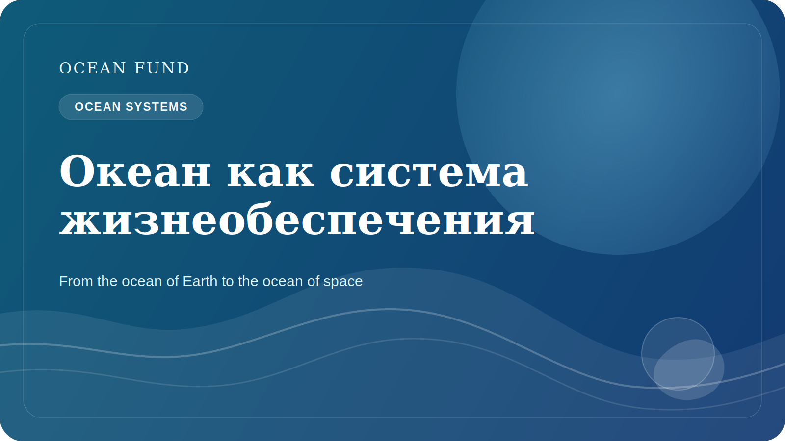

# L'ocean comme systeme de soutien a la vie sur Terre

Quand on parle de l'ocean, on imagine souvent l'eau, les cotes, les tempetes, les poissons, les navires ou de beaux horizons bleus. Pourtant, l'ocean n'est pas seulement un paysage ou une ressource. Il fonctionne comme l'un des principaux systemes de soutien a la vie sur Terre.

L'ocean aide a reguler le climat de la planete. Il absorbe une part importante de la chaleur excedentaire produite par l'augmentation des gaz a effet de serre dans l'atmosphere. Sans ce role tampon, les bouleversements climatiques sur les continents seraient encore plus brutaux. L'ocean participe aussi au cycle global du carbone par des processus physiques, chimiques et biologiques.

Son role climatique ne se limite pas aux chiffres des rapports scientifiques. L'etat de l'ocean influence les regimes de pluie, l'intensite des tempetes, la resilience des ecosystemes cotiers et la qualite de vie des regions littorales. Par l'atmosphere et la circulation oceanique, il est lie a l'agriculture, aux systemes alimentaires, aux infrastructures urbaines et a la securite de millions de personnes.

L'ocean est aussi un immense milieu biologique. Les ecosystemes marins soutiennent une extraordinaire diversite, du plancton et des coraux jusqu'aux mammiferes marins et aux organismes des grandes profondeurs encore imparfaitement connus. Cette biodiversite n'est pas importante uniquement en elle-meme. Elle est liee a la resilience des ecosystemes, aux chaines alimentaires, a la sante des zones cotières et a la capacite de la nature a repondre au stress.

En meme temps, l'ocean reste en partie inconnu. Nous en savons beaucoup plus qu'il y a un siecle, mais nous n'avons toujours pas cartographie le fond marin avec toute la precision voulue, ni decrit toutes les especes marines, ni compris pleinement comment l'ocean reagira au rechauffement, a l'acidification, a la deoxygenation, a la pollution et aux pressions industrielles.

C'est pourquoi l'ocean ne peut pas rester seulement un sujet reserve a des cercles experts. La connaissance oceanique doit entrer dans l'education, la science publique, le travail sur les donnees, la culture et la cooperation internationale. Il faut non seulement de la recherche, mais aussi des traductions de cette connaissance en cartes, essais, visualisations, conferences, registres de donnees ouverts et plateformes d'interet public.

Pour Ocean Fund, l'ocean n'est pas un theme bleu abstrait, mais un systeme vivant central de la planete. Si la societe veut comprendre le climat, la resilience, la biodiversite et l'avenir des regions cotieres, elle a besoin d'un langage clair pour penser l'ocean. C'est pourquoi l'ocean doit etre considere non comme un decor, mais comme l'un des grands objets de connaissance publique du XXIe siecle.

