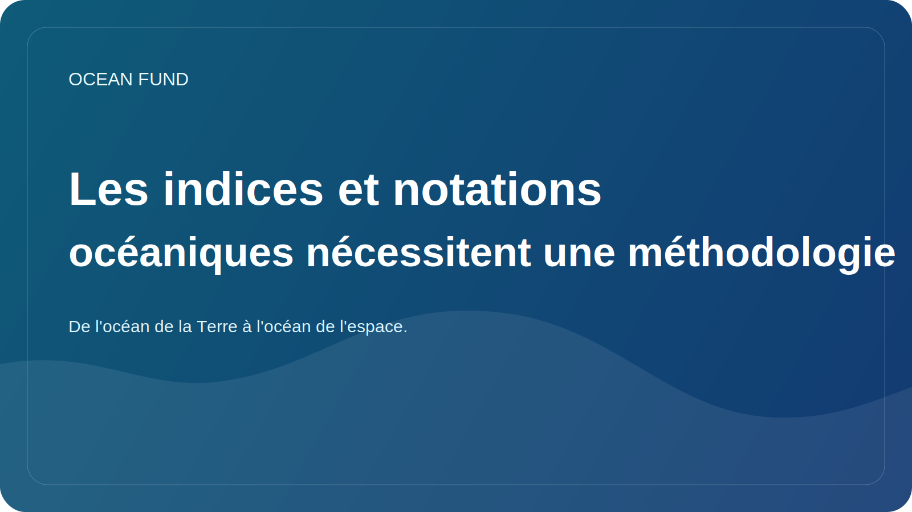

# Les indices et notations océaniques nécessitent une méthodologie

Les indices et les notations semblent très attractifs. Ils promettent des comparaisons rapides, des chiffres clairs et un moyen pratique de parler de réalités complexes. Dans le domaine des océans, c’est particulièrement tentant : trop de sujets, trop d’acteurs, trop de niveaux d’incertitude. J'aimerais avoir au moins un indicateur simple.

Mais c’est là que le risque entre en jeu. Plus le système est complexe, plus il faut être prudent en essayant de le réduire à un chiffre unique ou à une échelle comparative pratique. Si un indice n’explique pas quelles données sont utilisées, comment les pondérations sont choisies, comment les écarts sont pris en compte, comment les incertitudes sont interprétées et ce qui est exactement mesuré, il devient non pas un outil de connaissance mais un outil d’illusion.

Les indices océaniques peuvent être très utiles s’ils fonctionnent honnêtement. Ils aident à déceler des tendances, à remarquer les différences entre les régions, à engager des conversations politiques et à créer un langage commun pour les organisations, les donateurs, les chercheurs et les projets publics. Mais à condition que l’index ne cache pas la méthodologie derrière une belle visualisation.

Pour le Fonds Océan, ce sujet est particulièrement important car nous disposons déjà d'une couche d'index interne et externe : résumés de sites, cartes de données, atlas, files d'attente de publication, thèmes de tâches. Cela signifie que le projet doit créer dès le début une culture de transparence méthodologique. Si nous appelons quelque chose un index, une notation, un registre ou un atlas, nous devons clairement montrer les limites d'un tel outil.

Un bon indice ne simplifie pas la réalité jusqu’à la vacuité. Cela vous aide à naviguer tout en vous gardant honnête. Un mauvais indice donne une impression de précision là où il n’existe qu’un ensemble de signaux peu comparables. La différence entre eux réside dans la méthodologie.

Par conséquent, le débat sur les indices océaniques ne devrait pas se limiter au plan de la conception et de la communication, mais également à celui de la responsabilité épistémique. Un numéro sans explication peut être plus dangereux que pas de numéro. Et un indice doté d’une logique transparente peut devenir un outil public puissant pour naviguer dans un monde océanique complexe.
