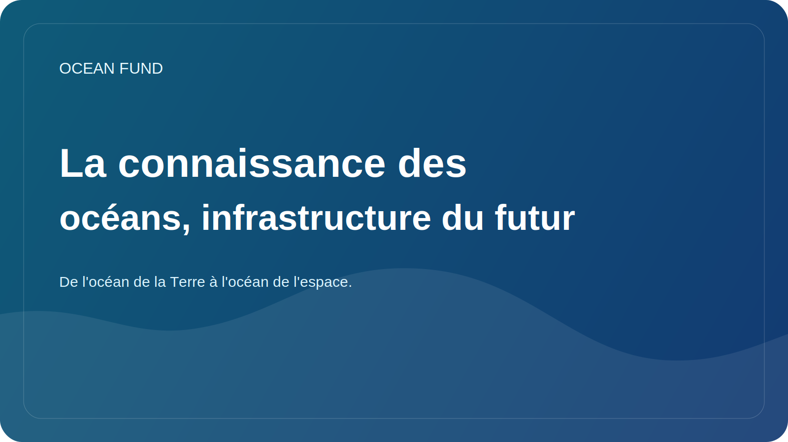

# La connaissance des océans, infrastructure du futur

La connaissance des océans ressemble souvent à quelque chose de plus : un sujet pédagogique utile, un bon format pour un musée, un atout pour les programmes scolaires. Mais en réalité, la connaissance des océans doit être considérée de manière plus large. Ce n'est pas une décoration pour l'agenda environnemental, mais une des infrastructures du futur.

Si une société comprend mal le rôle de l’océan, elle comprendra moins bien le climat, la biodiversité, les risques côtiers, les ressources marines, les chaînes d’approvisionnement mondiales et même les capacités de la science et de la technologie. L’analphabétisme océanien rend la conversation publique superficielle. Les décisions deviennent alors réactives plutôt que stratégiques.

La véritable connaissance des océans n’est pas une collection de beaux faits sur les baleines et les coraux. C’est la capacité de voir l’océan comme un système complexe, connecté à la vie terrestre, au climat mondial, aux données, à la politique internationale, aux systèmes alimentaires et à imaginer l’avenir. C’est aussi la capacité de distinguer les connaissances scientifiquement prouvées des simplifications et des affirmations à la mode mais faibles.

Au 21e siècle, une telle alphabétisation devrait s’appuyer non seulement sur des textes, mais aussi sur des données ouvertes, des cartes, des visualisations, la science citoyenne, les pratiques muséales, les référentiels GitHub, les mémoires publics, les conférences et le matériel événementiel. Autrement dit, nous ne parlons plus seulement d’éducation, mais d’infrastructures publiques connectées de connaissances.

Le Fonds Océan se construit précisément sur cette logique. Non seulement la recherche est importante pour nous, mais aussi les formes d’application des connaissances. Nous avons besoin non seulement de registres d’ensembles de données, mais également de pages de connexion claires, de one-pagers, de packs d’événements, d’énoncés de mission et d’essais destinés au public. Tout cela n’est pas un « emballage secondaire », mais fait partie de la façon dont le thème de l’océan entre dans la culture et la prise de décision.

À l’avenir, la connaissance des océans ne fera que gagner en importance. Le monde sera confronté à de nouveaux débats sur l’économie bleue, la résilience côtière, la technologie marine, la gouvernance des eaux profondes et le rôle de l’océan dans l’adaptation au climat. Et la qualité des décisions dépendra de la mesure dans laquelle la société dispose d’un langage pour ces conversations.

Par conséquent, la connaissance des océans doit être comprise comme une infrastructure. Il n’est pas aussi visible qu’un port, un satellite ou un laboratoire, mais sans lui, les connaissances circulent mal, les partenariats s’affaiblissent et l’agenda public devient vulnérable au bruit et à la manipulation. Pour le Fonds Océan, travailler sur de telles infrastructures est l'une de ses missions centrales.
