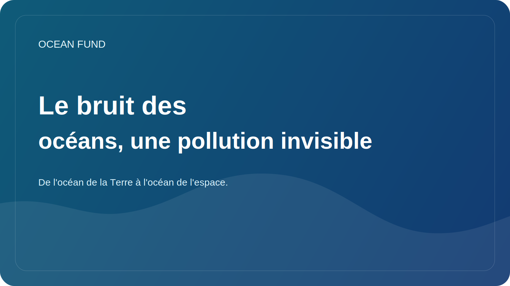

# Le bruit des océans, une pollution invisible

Lorsqu’il est question de pollution des océans, les gens pensent d’abord au plastique, au pétrole, aux eaux usées ou aux produits chimiques. Mais il existe un autre type de pollution près de l’océan, plus difficile à voir sur les photographies et donc plus facile à sous-estimer. C'est du bruit.

Pour les humains, l’océan peut sembler un environnement vaste et silencieux, mais pour de nombreux organismes marins, le son est l’un des canaux les plus importants pour percevoir le monde. Grâce au son, les animaux naviguent, recherchent des partenaires, communiquent, trouvent de la nourriture et reconnaissent le danger. Par conséquent, l’augmentation du bruit anthropique modifie non seulement le « contexte », mais aussi les conditions mêmes d’existence de la vie marine.

Il existe de nombreuses sources de bruit : transport maritime, construction, études sismiques, activité militaire, infrastructures industrielles. Leurs effets peuvent aller du stress à court terme aux perturbations à long terme du comportement et de la migration. Les espèces pour lesquelles l'environnement acoustique joue un rôle clé sont particulièrement sensibles.

Le problème du bruit océanique est également important car il ne cadre pas bien avec l’intuition écologique habituelle. Le plastique peut être montré entre vos mains. Une nappe de pétrole peut être photographiée. La pollution acoustique nécessite un langage différent : des graphiques, des ensembles de données d'hydrophones, des explicatifs, des cartes de navigation et une communication scientifique patiente.

C’est pourquoi le sujet du bruit montre bien pourquoi la société a besoin de données ouvertes et d’une traduction scientifique de haute qualité. Sans eux, la conversation dégénère facilement soit en ignorant complètement le problème, soit en déclarations dures mais mal étayées. Parallèlement, le bruit est un véritable facteur océanique qui nécessite une surveillance, des politiques et une compréhension du public.

Pour l'Ocean Fund, le thème du bruit océanique est intéressant en tant qu'exemple de « l'océan invisible » - ces processus qui sont importants sur le plan écologique, mais qui sont à peine représentés dans l'imaginaire populaire. Travailler sur de tels sujets est particulièrement précieux : ils élargissent la compréhension du public sur l’océan et montrent que sa vulnérabilité n’a peut-être pas toujours l’air dramatique dans le tableau, mais cela ne la rend pas moins grave.
