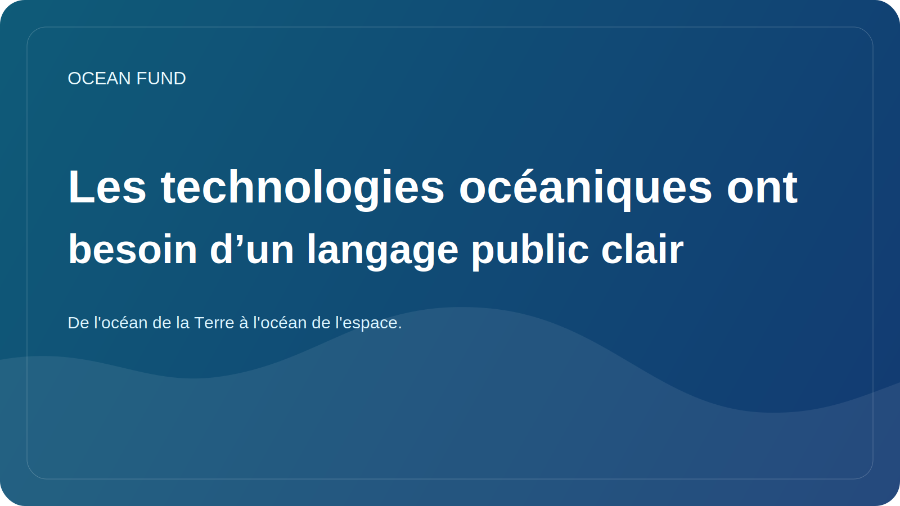

# Les technologies océaniques ont besoin d’un langage public clair

La technologie océanique se développe rapidement. Plateformes autonomes, services satellitaires, capteurs sous-marins, systèmes acoustiques, cartographie bathymétrique, robotique marine, plateformes de données et nouveaux outils analytiques élargissent constamment notre capacité à observer et à travailler avec l'océan. Mais la compréhension du public à l’égard de cette couche est à la traîne.

Souvent, la couche technologique est présentée soit comme quelque chose de trop étroit et trop technique, soit comme une excuse pour une narration trop optimiste. Dans le premier cas, le sujet reste fermé à un large public. Dans le second cas, les technologies se transforment en un ensemble de promesses sans restrictions, coûts, risques et qualité des preuves.

Un langage public clair est nécessaire précisément pour éviter ces deux distorsions. Il ne doit pas simplifier les technologies au point de les rendre insignifiantes, mais il ne doit pas non plus les laisser dans le jargon professionnel. Il est important que la société comprenne ce que mesure le capteur, comment fonctionne la plateforme d’observation, ce que signifie la qualité des données, pourquoi l’étalonnage est nécessaire et pourquoi le faire.

Ceci n’est pas seulement important pour l’éducation. Sans un tel langage, il est difficile d’établir des partenariats entre ingénieurs, musées, fondations, universités, organisateurs d’événements et acteurs politiques. Chacun d’eux entend différemment la même technologie. S’il n’existe pas de couche de traduction commune, la collaboration s’arrête rapidement.

Pour le Fonds Océan, les technologies océaniques ne constituent pas une branche à part entière « pour les ingénieurs ». Elle fait partie de l’infrastructure publique générale de la connaissance. Nous avons besoin d’un langage qui relie l’instrumentation, l’observation par satellite, l’analyse des données, l’éducation, les expositions et le récit océan-espace. Ce n’est qu’à ce moment-là que la technologie cessera d’être une boîte noire et fera partie d’un débat public compréhensible.

L’avenir de l’agenda océanique dépend en grande partie de la capacité de la société à parler de technologie sans battage médiatique naïf et sans aliénation. Créer un tel langage est déjà un travail indépendant. Et pour des projets comme le Fonds Océan, cela devrait être intégré dans la structure même des documents publics.
