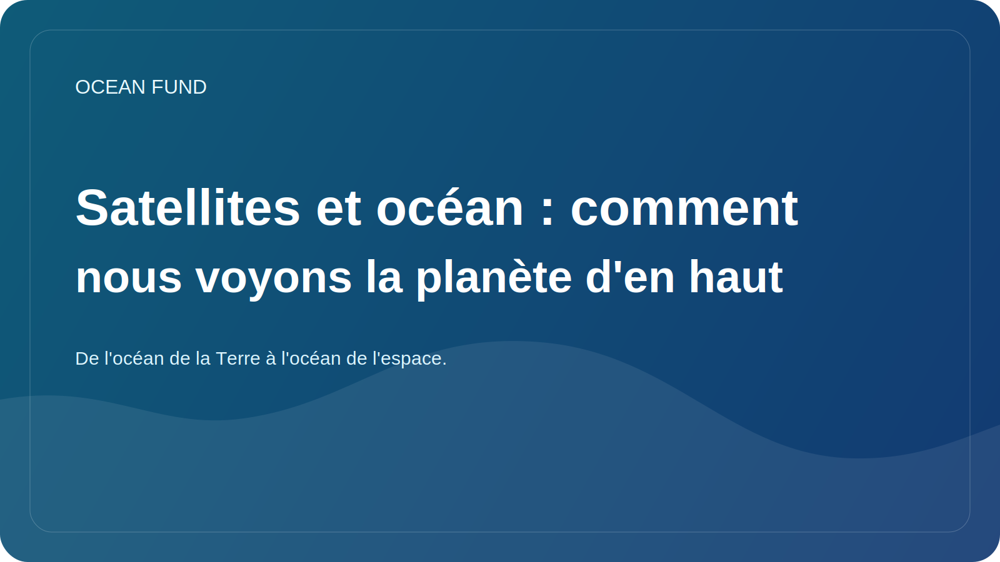

# Satellites et océan : comment nous voyons la planète d'en haut

La compréhension moderne de l’océan est impossible sans satellites. Si auparavant de nombreuses idées sur l'environnement marin reposaient sur des expéditions, des bouées et des mesures côtières, aujourd'hui l'observation de la Terre depuis l'espace joue un rôle énorme. C’est ce qui nous donne l’échelle, la comparabilité et la capacité de voir de grands processus spatiaux presque en temps réel.

Les satellites permettent d'observer la température de la surface de la mer, la couleur de l'océan, la répartition des glaces, la hauteur de la surface, les grands courants, la turbidité, les proliférations de phytoplancton et bien d'autres caractéristiques. Cela ne rend pas les mesures traditionnelles inutiles, mais les améliore radicalement, permettant de relier les observations locales à la situation globale.

Ce lien est particulièrement important pour le climat, la durabilité côtière et le travail éducatif. Lorsque nous voyons l’océan d’en haut, il devient plus clair qu’il ne s’agit pas d’une « masse bleue » statique, mais d’un système dynamique avec des fronts, des tourbillons, des cycles saisonniers, des poussées biologiques et de vastes modèles climatiques. L’observation spatiale change l’échelle même de notre perception de l’océan.

Mais là aussi, la prudence est de mise. Une image satellite n’est pas une « photographie directe de la vérité », mais le résultat d’un traitement, de modèles, d’un calibrage et d’une interprétation complexes. Par conséquent, le travail public avec des données satellitaires nécessite de bonnes sources, des avertissements clairs et des explications claires des limites. Sinon, une belle image peut donner lieu à des conclusions erronées.

Pour le Fonds Océan, la couche satellite est particulièrement importante car elle relie naturellement les océans de la Terre aux océans de l'espace. Nous étudions le milieu marin grâce à des instruments extérieurs à l’atmosphère. Cela crée un puissant pont éducatif et intellectuel entre l'océanographie, l'observation de la Terre, les missions spatiales et l'exploration à long terme.

C'est l'une des forces du thème océanique : il permet de parler de la Terre comme d'un système que l'on comprend mieux précisément lorsque l'on est capable de la regarder à la fois de l'intérieur et d'en haut. Les satellites rendent cette vue possible. Et la tâche des plateformes publiques comme le Fonds Océan est de le traduire dans un langage compréhensible, soigné et utile à la société.
