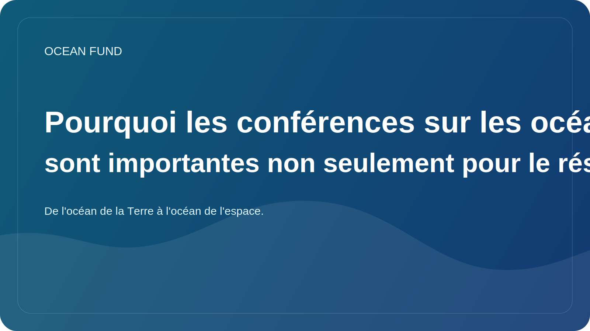

# Pourquoi les conférences sur les océans sont importantes non seulement pour le réseautage

Les conférences sur les océans apparaissent souvent à l'observateur extérieur comme un mélange de conférences, de panels, de stands et de réunions d'affaires. Sous cette forme, ils peuvent ressembler à un rituel d’une communauté professionnelle. Mais en réalité, les bons événements océaniques jouent un rôle bien plus important : ils contribuent à relier la recherche, les politiques, les données, l’éducation, la technologie et la communication publique.

L’agenda océanique est trop complexe pour être vécu au sein d’une seule discipline. Biologiste marin, analyste de satellites, conservateur de musée, planificateur côtier, développeur de capteurs, bailleur de fonds philanthropique et organisateur de programmes éducatifs travaillent rarement dans le même circuit quotidien. Les conférences et les forums deviennent des lieux où ces langues disparates sont au moins temporairement réunies.

C’est pourquoi un espace événementiel de haute qualité n’est pas seulement important pour le réseautage. Il est nécessaire au transfert entre les couches. Le résultat scientifique doit rencontrer une communication publique. La plateforme de données doit rencontrer l'éducateur ou l'équipe du musée. Le débat politique doit tenir compte de la science des écosystèmes, et l’optimisme technologique doit tenir compte des limites et des risques.

Pour le Fonds Océan, cette couche est particulièrement importante. Le projet est construit comme une infrastructure ouverte et non comme un groupe de recherche fermé. Cela signifie que nous avons besoin d'événements non seulement comme lieu de présentation de soi, mais aussi comme terrain de reconnaissance, de test de langage, de recherche de partenaires, de comparaison de sujets et de transformation des idées en matériaux concrets : notes d'information, one-pagers, fiches d'ensembles de données, ateliers et packages publics.

Il existe une autre raison de prendre au sérieux les événements océaniques. Ils façonnent la façon dont le thème de l’océan sera entendu par la société dans les années à venir. Si la scène n’est dominée que par des slogans bruyants, du battage médiatique ou de vagues promesses, alors l’agenda public s’affaiblit. Si l’événement est lié aux données, à la méthodologie, à la responsabilité écosystémique et à une bonne traduction de la science, il fait vraiment avancer le domaine.

Par conséquent, les conférences, expositions et forums océaniques ne constituent pas un niveau de « communication » secondaire. Cela fait partie de l’infrastructure même de la connaissance océanique. Et plus nous apprenons à utiliser ces espaces, plus le lien entre l’océan, la société et les solutions futures se renforcera.
