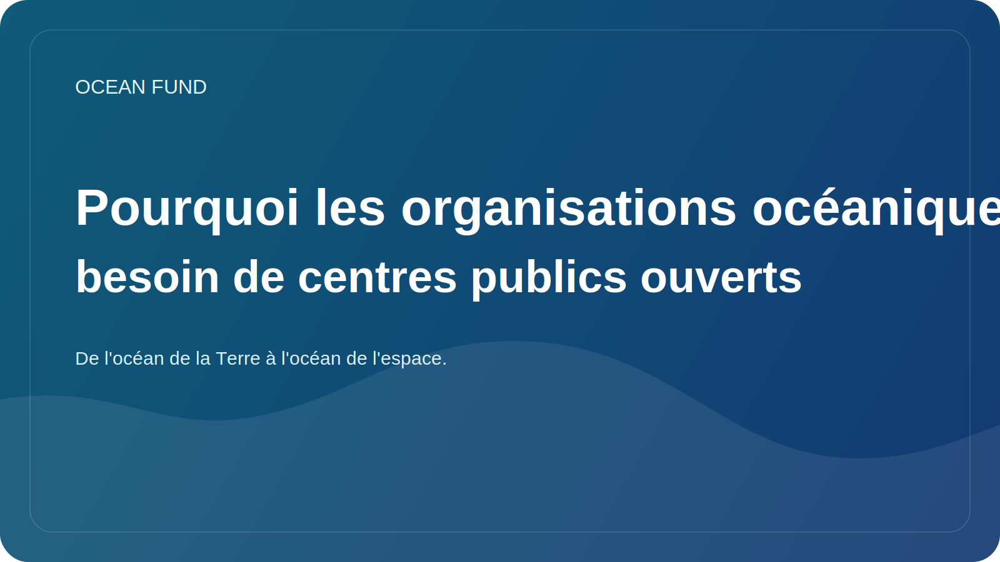

# Pourquoi les organisations océaniques ont besoin de centres publics ouverts

De nombreuses organisations océaniques produisent du matériel utile : études, présentations, cartes, notes d’orientation, programmes d’événements, textes pédagogiques, lettres, ensembles de données et visualisations. Mais trop souvent, ces matériaux vivent dans des systèmes disparates. Quelque chose se trouve dans le courrier, quelque chose dans les dossiers cloud, quelque chose sur le site Web, quelque chose dans les dossiers personnels de l'équipe et quelque chose disparaît une fois le projet terminé.

Le problème ici n’est pas seulement l’inconvénient. La fragmentation affaiblit la présence très publique d’une organisation. Il devient difficile pour un étranger de comprendre de quel type de projet il s'agit, ce qu'il représente, comment y accéder, quels matériaux existent déjà et comment distinguer une ébauche d'un résultat prêt à être rendu public.

Un hub public ouvert résout ce problème non pas grâce à un design élégant, mais grâce à une architecture claire. Il doit rassembler la mission, les orientations de recherche, les sources de données, les dossiers d'événements, les pages d'une page, les notes de gouvernance, la file d'attente des problèmes et les itinéraires de participation en un seul endroit. Le projet cesse alors de dépendre de la mémoire des individus et commence à fonctionner comme un système.

Ceci est particulièrement important pour l’agenda océanique. Il y a trop d’intersections entre la science, les données, l’éducation, la technologie et les partenariats. Si une organisation ne dispose pas d’un noyau public stable, chaque nouvelle communication repart presque de zéro. L’équipe dépense de l’énergie à répéter des explications de base au lieu de développer le terrain.

GitHub dans cette logique n'est pas seulement intéressant en tant que lieu de code. Il peut agir comme une mémoire opérationnelle ouverte : un espace où les documents, articles, problèmes, discussions, registres de données et documents destinés aux partenaires sont interconnectés. Cette approche renforce la confiance car elle montre la structure, l'état des matériaux et la direction du mouvement.

Pour le Fonds Océan, un hub ouvert n’est pas un outil secondaire, mais l’une des principales formes d’existence du projet. Si une organisation océanique veut être compréhensible, vérifiable et prête à collaborer, elle n’a pas seulement besoin d’un site Web et d’un simple dossier de fichiers, mais d’un système public vivant. C’est ce qui fait d’un hub ouvert un atout stratégique plutôt qu’un détail technique.
