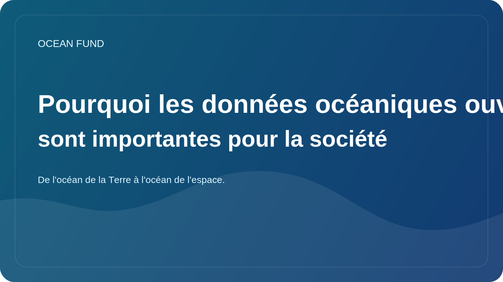

# Pourquoi les données océaniques ouvertes sont importantes pour la société

Aujourd’hui, parler de l’océan est impossible sans données. La température de la surface de la mer, la salinité, la bathymétrie, les observations satellitaires, la répartition des espèces, la santé des coraux, la glace de mer, la pollution et les risques côtiers sont de plus en plus décrits non seulement par des mots mais aussi par des mesures. Toutefois, les données à elles seules ne créent pas d’intérêt public.

Les données océaniques ouvertes sont importantes car elles permettent à différents groupes de travailler sur la même réalité. Un chercheur examine du matériel scientifique, un enseignant obtient les bases d'un cours, un musée peut créer une histoire visuelle, un journaliste peut vérifier une affirmation et un développeur peut créer un outil ou une carte. Lorsque l’accès aux données est ouvert, l’agenda océanique cesse d’être un club professionnel fermé.

Mais l’ouverture n’est pas synonyme de compréhensibilité automatique. Même les bonnes données restent souvent difficiles à utiliser en externe. Un ensemble peut avoir une licence complexe, des restrictions peu évidentes, un format technique incompréhensible pour un non-spécialiste ou des métadonnées qui nécessitent une traduction séparée en langage humain. Entre « les données existent » et « la société peut les utiliser », il y a donc un gros travail d’interprétation.

C’est là que les fiches d’ensembles de données, les registres de sources, les glossaires, les cahiers, les fiches de démonstration et les notes d’information soignées destinées au public sont particulièrement importantes. Ils ne remplacent pas la science, mais créent un pont entre un spécialiste et un public extérieur. Un tel pont n’est pas seulement nécessaire pour l’éducation. Cela est également nécessaire pour un débat plus responsable sur les risques, les infrastructures, le climat, la politique côtière et la conservation.

Les données ouvertes réduisent également le recours à des affirmations fantaisistes mais vides de sens. Si un projet parle d’océan, de protection des océans, de surveillance ou d’économie bleue, il doit y avoir un moyen de vérifier sur quoi est basé le libellé. Avoir une source ouverte, une date d'accès, une description des restrictions et un statut de vérification rend le discours public plus fort et plus honnête.

Pour le Fonds Océan, les données océaniques sont bien plus qu’une simple ressource technique. C’est la base de la confiance du public, du travail éducatif et de la coopération internationale. Grâce aux données ouvertes, vous pouvez créer des cartes, des conférences, des mémoires, du matériel événementiel, des propositions de partenariat et des questions de recherche. Ils contribuent à relier les sciences océaniques à la société sans perdre en rigueur.

À l’avenir, l’importance de cette couche ne fera que croître. À mesure que de plus en plus de missions satellitaires, de réseaux de capteurs, de plates-formes sous-marines et de programmes d’observation mondiaux seront disponibles, l’infrastructure qui nous empêche de nous noyer sous le déluge d’informations deviendra plus importante. La société n’a pas seulement besoin de portails de données, mais aussi de systèmes de navigation clairs basés sur les données océaniques. La création de tels systèmes n’est plus une tâche secondaire mais fait partie de la culture océanique moderne.
