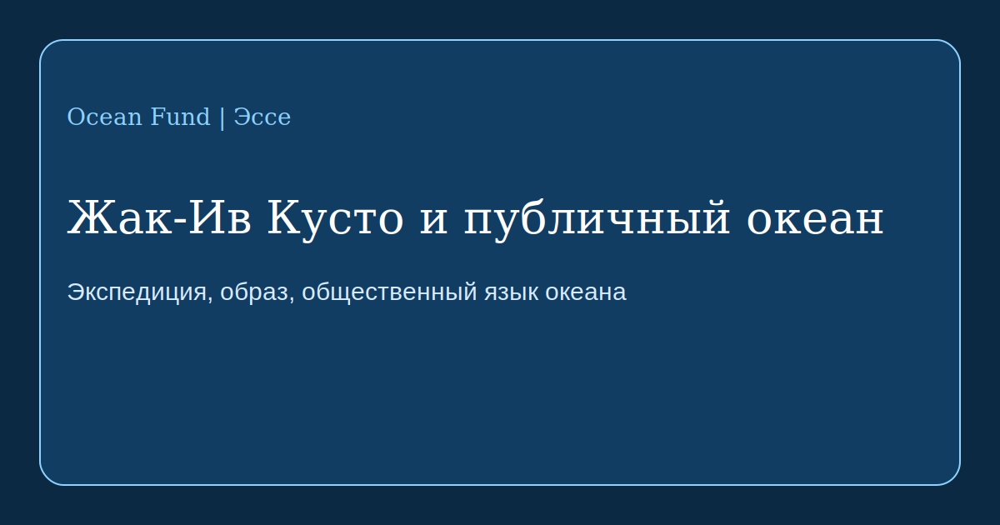

# Жак-Ив Кусто и публичный океан

Жак-Ив Кусто важен не только как исследователь моря, изобретатель или автор знаменитых фильмов. Он важен как человек, который помог перевести океан из закрытой профессиональной среды в пространство массового воображения. До Кусто океан был для большинства либо романтическим фоном, либо областью военной, рыболовной и научной практики. После Кусто океан стал ещё и публичной сценой знаний, тревоги, красоты и ответственности.

Официальная история [Cousteau Society](https://www.cousteau.org/know/vessels/calypso/) показывает, что Калипсо была не просто судном. Это была плавучая лаборатория, киностудия, дом экспедиционной команды и платформа для изобретений. Через неё Кусто соединял экспедицию, съёмку, технику и рассказ. Именно это соединение оказалось одним из его главных вкладов. Он не только нырял и исследовал. Он строил язык, с помощью которого общество могло увидеть подводный мир как часть собственной судьбы.

Этот язык складывался из нескольких элементов. Во-первых, из техники: акваланг, подводные камеры, батискафы вроде знаменитой «ныряющей тарелки» [Diving Saucer](https://www.cousteau.org/know/inventions/diving-saucer/), наблюдательные окна, турбопарус и новые форматы морской мобильности. Во-вторых, из маршрута: Средиземное море, Красное море, Амазонка, Антарктика, Персидский залив, море Кортеса, атоллы и острова, куда научный текст сам по себе никогда бы не привёл миллионы зрителей. В-третьих, из драматургии: Кусто превращал экспедицию в общественный сюжет.

По данным Cousteau Society, в 1977 году команда на борту Calypso провела исследование загрязнения Средиземного моря в 13 странах, а в 1985 году запустила кругосветную экспедицию на Calypso и Alcyone. Эти проекты важны не только как эпизоды научной истории. Они показывают, что экспедиция может быть одновременно исследованием, дипломатией, медиа-проектом и формой экологического предупреждения.

Для Ocean Fund в этом есть прямой урок. Недостаточно просто собирать данные, писать внутренние документы или фиксировать проблемы океана. Нужен публичный перевод: эссе, карты, выставочные тексты, школьные маршруты, лекции, визуальные истории, партнёрские страницы и многоязычные материалы, которые делают океан понятным и близким. Кусто не заменяет современную науку, но напоминает, что между исследованием и обществом всегда нужен медиум.

Важно и другое: Кусто полезно изучать не как икону без ошибок, а как модель публичного океанического посредничества. Сегодня у нас другие этические стандарты, другие технологические возможности и другой масштаб экологических угроз. Но задача остаётся прежней: сделать океан не абстракцией, а видимой частью коллективного мышления.

Если Ocean Fund хочет двигаться по формуле «От океана Земли к океану космоса», ему нужен именно такой уровень общественного языка. Не только научная точность, но и способность строить образы, маршруты внимания и долговременную связь между человеком, экспедицией и планетарной водой.
