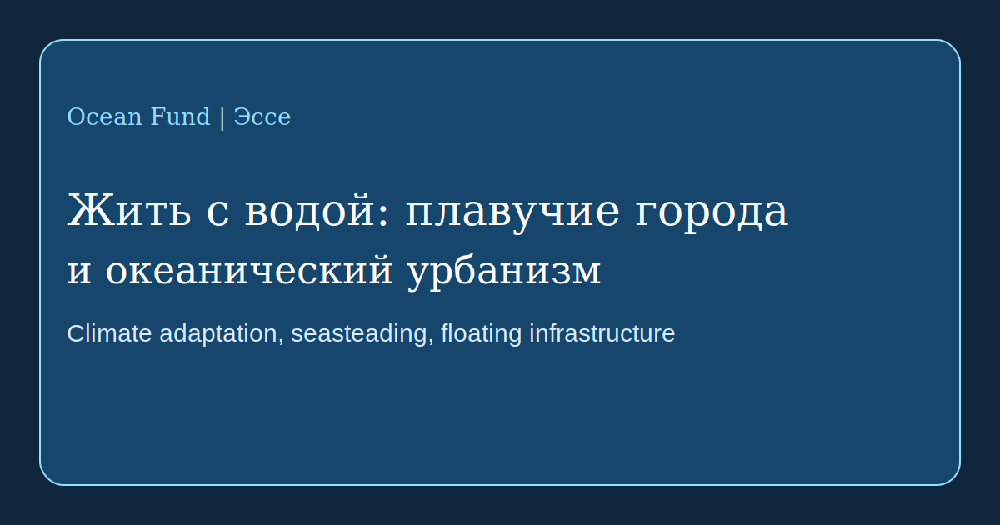

# Жить с водой: плавучие города и океанический урбанизм

Тема городов на воде давно перестала быть чистой научной фантастикой, но она всё ещё находится на границе между экспериментом, инженерией, климатической адаптацией и политическим воображением. Именно поэтому к ней нужно подходить без восторженного тумана и без автоматического скепсиса. Плавучая инфраструктура уже существует в разных формах, но вопрос теперь не в том, можно ли строить на воде, а в том, какой общественный смысл у таких систем и кому они реально служат.

На одной стороне этого поля находятся проекты климатической и городской адаптации. [UN-Habitat](https://unhabitat.org/news/27-apr-2022/un-habitat-and-partners-unveil-oceanix-busan-the-worlds-first-prototype-floating) вместе с партнёрами представил OCEANIX Busan как прототип устойчивого плавучего городского расширения для прибрежных городов, уязвимых к подъёму уровня моря, дефициту земли и климатическим рискам. Здесь логика не в бегстве от суши, а в поиске новых форм берегового развития.

На другой стороне находятся более радикальные линии, связанные с автономией, морскими сообществами и культурой seasteading. [The Seasteading Institute](https://www.seasteading.org/about/) прямо говорит о плавающих сообществах как о пространстве для социальных экспериментов, а в своих [active projects](https://www.seasteading.org/active-projects/) показывает более широкий спектр направлений: от марикультуры и волноломов до жилых и производственных платформ. Параллельно такие компании, как [Ocean Builders](https://oceanbuilders.com/about-us/), переводят тему в сторону продуктового дизайна, модульного жилья и «жизни над волнами».

Между этими двумя полюсами существует третья линия: адаптивная водная архитектура. Здесь важны такие практики, как [Waterstudio](https://www.waterstudio.nl/built-on-water-floating-houses/), которые рассматривают плавучее строительство не как отдельную утопию, а как расширение городского планирования в условиях изменяющейся воды. Эта логика ближе не к «новой цивилизации посреди океана», а к постепенному перестраиванию отношений между городом, берегом, инфраструктурой и наводнением.

Для Ocean Fund здесь особенно важно удерживать несколько вопросов одновременно. Кто будет жить на воде? Для чего именно строится плавучая система: для роскоши, для климатической адаптации, для научной базы, для туризма, для марикультуры, для временного жилья или для публичного эксперимента? Как устроены отходы, энергия, пресная вода, обслуживание, доступность, безопасность и правовой режим? И как меняются эти ответы между экваториальными, умеренными и холодными акваториями?

Именно поэтому тема seasteading и floating cities заслуживает не лозунгов, а серьёзного исследовательского слоя. В одних случаях это может быть полезным направлением для прибрежной устойчивости и новых типов океанической инфраструктуры. В других это может оказаться дорогой витриной, плохо связанной с общественным благом. Между этими крайностями и находится реальная работа: разбирать кейсы, сравнивать модели, отслеживать инженерные, экологические и социальные последствия.

Для Ocean Fund эта тема важна не как экзотический сюжет, а как часть большой линии «жить с водой». Если XXI век будет веком климатического давления на берега, то язык океанического урбанизма понадобится не только архитекторам и инвесторам, но и исследователям, журналистам, музеям, городам и общественным платформам. Говорить о будущем океана значит говорить и о будущих формах жизни на воде.
