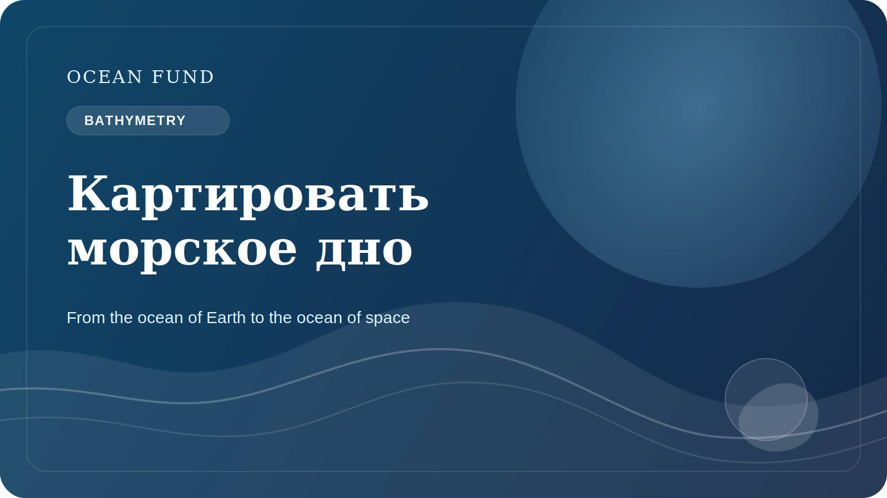

# Картировать морское дно значит картировать будущее

На суше мы привыкли считать карту чем-то базовым. Карты городов, дорог, рек, границ и рельефа кажутся почти само собой разумеющимися. Но когда речь заходит об океане, особенно о морском дне, картина меняется. Значительная часть подводного рельефа до сих пор известна не так подробно, как хотелось бы современной науке и обществу.

Это не просто техническая проблема картографии. Морское дно важно для понимания геологии, экосистем, циркуляции, маршрутов кабелей и инфраструктуры, рисков, связанных с оползнями и цунами, и будущего глубоководных решений. Без хороших bathymetric maps трудно говорить о долгосрочной морской политике и ответственной работе с океаном.

Кроме того, картирование дна важно символически. Оно напоминает, что на нашей собственной планете остается огромный слой пространства, который еще не виден нам достаточно ясно. В эпоху спутников и цифровых платформ легко забыть, насколько много физического мира все еще описано неполно.

Для Ocean Fund тема морского дна важна и как научная, и как культурная. Она позволяет говорить об океане как о frontier не только в романтическом смысле, но и в практическом: frontier данных, наблюдений, инфраструктуры и знаний. Через bathymetry удобно связывать науку, технологии, визуализацию и public imagination.

Есть и еще один важный аспект. Когда мы картируем морское дно, мы фактически картируем пространство будущих решений. Какие зоны уязвимы? Где есть важные экосистемы? Где наши знания все еще слишком слабы? Где технология может помочь, а где нужно больше осторожности? Карта становится не просто изображением, а основой для мышления.

Поэтому работа над морским дном — это не дело узких специалистов alone. Обществу тоже важно понимать, почему дно океана не является “пустым пространством под водой”. Это одна из больших структур нашей планеты. И чем лучше мы ее видим, тем ответственнее можем говорить о будущем океана.

