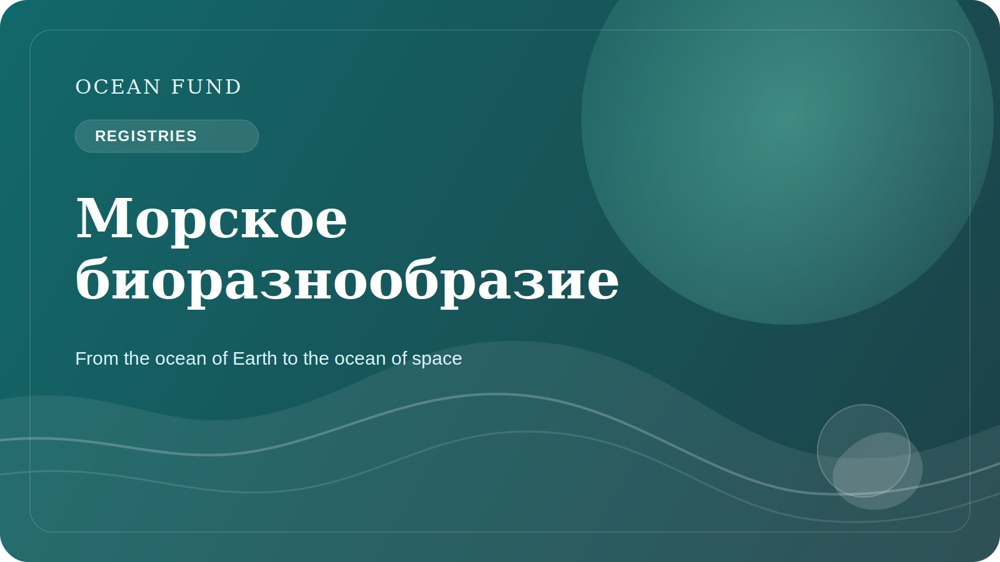

# Морскому биоразнообразию нужны открытые реестры

Морское биоразнообразие огромно, но не всегда хорошо видно обществу. Люди могут знать о китах, кораллах, акулах или морских черепахах, но реальная структура жизни в океане намного шире и сложнее. Огромное количество организмов, экосистем и взаимосвязей остается за пределами массового восприятия.

Именно поэтому открытые реестры, каталоги и biodiversity data systems так важны. Они дают возможность не только хранить данные, но и делать жизнь океана видимой в более системном смысле. Через такие системы можно понимать распределение видов, таксономические связи, исторические наблюдения, gaps in knowledge и связи между разными datasets.

Для науки это базовая инфраструктура. Но и для общества она не менее важна. Если журналист, educator, museum curator, student или policy team не может быстро найти reliable biodiversity reference point, то разговор о conservation становится слабее. Он опирается на отдельные яркие примеры вместо системного понимания.

Открытые реестры также помогают бороться с двумя крайностями. С одной стороны, они снижают хаос и дублирование. С другой — защищают от соблазна говорить об океанической жизни в слишком общих и неоперациональных терминах. Когда есть реестр, atlas или linked data system, появляется возможность говорить точнее.

Для Ocean Fund этот слой важен как часть общей data and knowledge infrastructure. Мы хотим связывать science, education, public narrative и partner work. Без открытых biodiversity registries этот мост будет неполным. Они позволяют делать dataset cards, educational notebooks, event visuals, species explainers и public briefs, которые основаны не на случайных фактах, а на устойчивой базе знаний.

Морское биоразнообразие нуждается не только в защите, но и в видимости. Открытые реестры — один из способов дать этой видимости форму. А значит, они являются частью не только data culture, но и культуры океанической ответственности.

