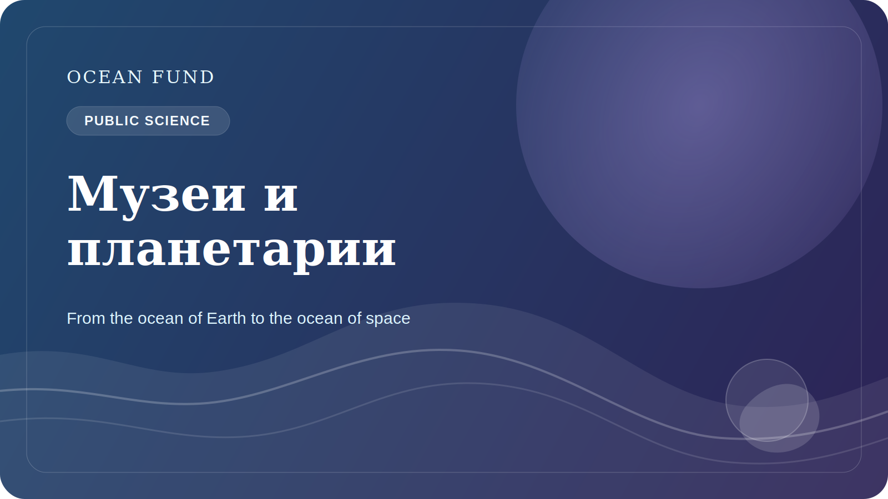

# Музеи и планетарии как океанические ворота для общества

Океаническая тема не должна жить только в лабораториях, отчетах и специализированных data portals. Чтобы общество действительно понимало роль океана, нужны пространства, где знание становится видимым, эмоционально доступным и интеллектуально связным. Именно поэтому музеи, научные центры и планетарии так важны для океанической повестки.

Музей умеет делать то, что редко получается у сухих документов: превращать сложную систему в переживаемый опыт. Через экспозицию, карту, модель, видео, интерактивную станцию или лекционную программу человек может увидеть океан не как абстрактный фон планеты, а как живую среду, связанную с климатом, биоразнообразием, данными и будущим побережий.

Планетарии добавляют к этому еще одно измерение. Они естественным образом помогают строить мост между океаном Земли и космической перспективой. Через спутниковые наблюдения, Earth observation, ocean worlds и тему обитаемости планетарий может показать, что разговор об океане — это одновременно разговор о нашей планете и о более широком вопросе жизни во Вселенной.

Такой мост особенно ценен, потому что он делает науку шире и интереснее, не теряя строгости. Океанология встречается с астробиологией. Морские данные встречаются со спутниками. Климатическая тема встречается с long-horizon imagination. Для public science это очень сильный формат.

Для Ocean Fund музеи и планетарии — не просто потенциальные партнеры для “просветительских активностей”. Это институции, способные превращать public narrative в устойчивую культурную инфраструктуру. Через них можно запускать лекции, выставочные модули, визуализации, educational kits, event formats и междисциплинарные мосты между океаном, данными и космосом.

Если общество хочет по-настоящему научиться видеть океан как центральную систему жизни на Земле, ему нужны не только papers и dashboards. Ему нужны культурные ворота входа. И музеи с планетариями — одни из самых сильных таких ворот.

