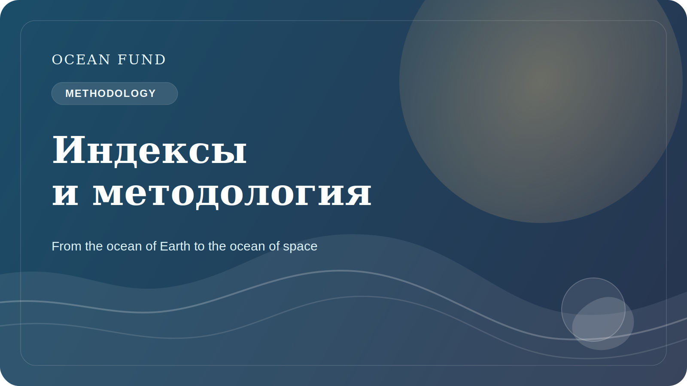

# Океанические индексы и рейтинги требуют методологии

Индексы и рейтинги выглядят очень привлекательно. Они обещают быстрое сравнение, ясную цифру и удобный способ говорить о сложной реальности. В океанической повестке это особенно соблазнительно: слишком много тем, слишком много actors, слишком много уровней неопределенности. Хочется иметь хотя бы один простой показатель.

Но именно здесь и возникает риск. Чем сложнее система, тем осторожнее нужно относиться к попыткам свести ее к одному числу или к удобной сравнительной шкале. Если индекс не объясняет, какие данные используются, как выбираются веса, как учитываются пробелы, как интерпретируются неопределенности и что именно измеряется, он становится не инструментом знания, а инструментом иллюзии.

Океанические индексы могут быть очень полезны, если они работают честно. Они помогают увидеть паттерны, заметить различия между регионами, выстроить policy conversation и создать общий язык для организаций, доноров, исследователей и общественных проектов. Но только при условии, что индекс не скрывает методологию за красивой визуализацией.

Для Ocean Fund эта тема особенно важна, потому что у нас уже есть внутренний и внешний индексный слой: site summaries, data maps, atlases, publication queues, task themes. Это значит, что проекту нужно формировать культуру методологической прозрачности с самого начала. Если мы называем что-то индексом, рейтингом, register или atlas, мы должны ясно показывать границы такого инструмента.

Хороший индекс не упрощает реальность до бессодержательности. Он помогает ориентироваться, сохраняя честность. Плохой индекс создает впечатление точности там, где есть только набор плохо сопоставимых сигналов. Разница между ними — это и есть методология.

Поэтому разговор об океанических индексах должен идти не только в плоскости дизайна и коммуникации, но и в плоскости epistemic responsibility. Цифра без объяснения может быть опаснее, чем отсутствие цифры. А индекс с прозрачной логикой может стать мощным public tool для навигации по сложному океаническому миру.

