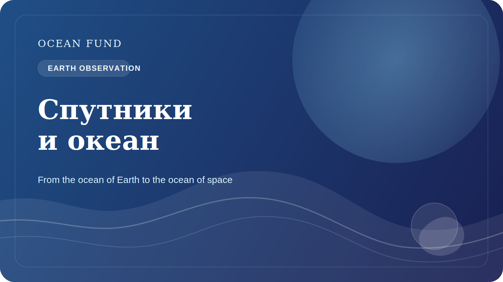

# Спутники и океан: как мы видим планету сверху

Современное понимание океана невозможно без спутников. Если раньше многие представления о морской среде строились на экспедициях, буях и береговых измерениях, то сегодня огромную роль играет наблюдение Земли из космоса. Именно оно дает нам масштаб, сопоставимость и способность видеть большие пространственные процессы почти в реальном времени.

Спутники позволяют наблюдать температуру поверхности моря, цвет океана, распределение льда, высоту поверхности, крупные структуры течений, мутность, цветение фитопланктона и многие другие характеристики. Это не делает традиционные измерения ненужными, но radically усиливает их, позволяя связывать локальные наблюдения с глобальной картиной.

Особенно важна эта связка для климата, прибрежной устойчивости и образовательной работы. Когда мы видим океан сверху, становится понятнее, что это не статичная “синяя масса”, а динамическая система с фронтами, вихрями, сезонными циклами, биологическими всплесками и крупными климатическими паттернами. Космическое наблюдение меняет сам масштаб нашего восприятия океана.

Но и здесь требуется аккуратность. Спутниковый снимок — это не “прямая фотография истины”, а результат сложной обработки, моделей, калибровки и интерпретации. Поэтому публичная работа со спутниковыми данными требует хороших источников, понятных оговорок и ясного объяснения ограничений. Иначе красивое изображение может породить неверные выводы.

Для Ocean Fund спутниковый слой особенно важен, потому что он естественно связывает океан Земли с океаном космоса. Мы изучаем морскую среду через инструменты, выведенные за пределы атмосферы. Это создает мощный образовательный и интеллектуальный мост между океанографией, Earth observation, космическими миссиями и long-horizon exploration.

В этом и состоит одна из сильных сторон океанической темы: она помогает говорить о Земле как о системе, которую мы понимаем лучше именно тогда, когда умеем смотреть на нее и изнутри, и сверху. Спутники делают этот взгляд возможным. А задача публичных платформ вроде Ocean Fund — перевести его в понятный, аккуратный и полезный для общества язык.

