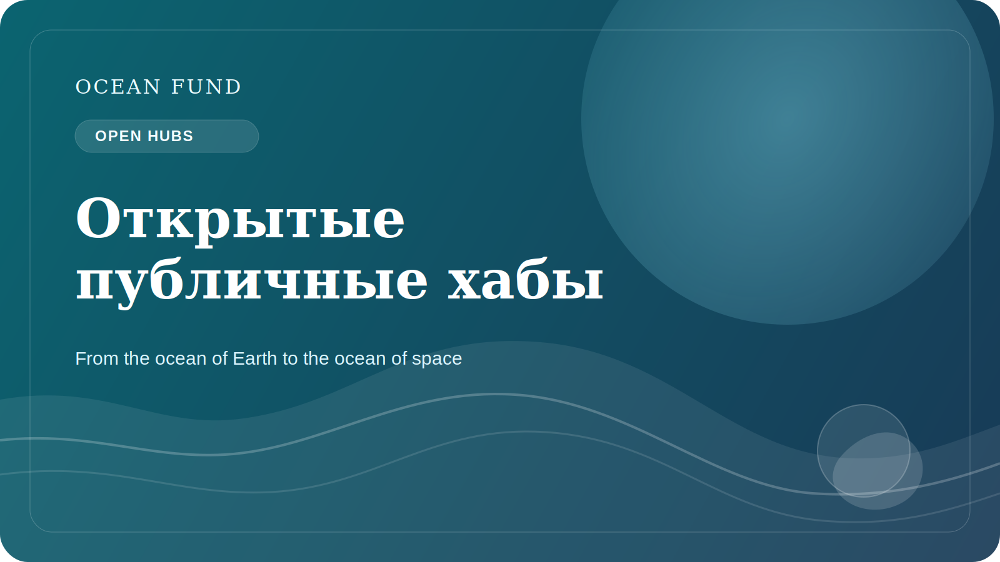

# Почему океаническим организациям нужны открытые публичные хабы

Многие океанические организации производят полезные материалы: исследования, презентации, карты, policy briefs, event programmes, образовательные тексты, письма, наборы данных и визуализации. Но слишком часто эти материалы живут в разрозненных системах. Что-то лежит в почте, что-то в cloud folders, что-то на сайте, что-то в личных папках команды, а что-то исчезает после завершения проекта.

Проблема здесь не только в неудобстве. Фрагментация ослабляет само общественное присутствие организации. Внешнему человеку становится трудно понять, что это за проект, на чем он стоит, как в него войти, какие материалы уже существуют и как отличить draft от public-ready output.

Открытый публичный хаб решает эту проблему не за счет красивого дизайна, а за счет архитектуры ясности. Он должен собирать миссию, research directions, data sources, event packs, one-pagers, governance notes, issue queue и маршруты участия в одном месте. Тогда проект перестает зависеть от памяти отдельных людей и начинает работать как система.

Для океанической повестки это особенно важно. Здесь слишком много пересечений между наукой, данными, образованием, технологиями и партнерствами. Если у организации нет устойчивого публичного ядра, каждая новая коммуникация начинается почти с нуля. Команда тратит силы на повторение базовых объяснений вместо того, чтобы развивать поле.

GitHub в этой логике интересен не только как место для кода. Он может работать как открытый operational memory: пространство, где документы, статьи, issues, discussions, data registers и partner-facing materials связаны между собой. Такой подход усиливает доверие, потому что показывает структуру, статус материалов и направление движения.

Для Ocean Fund открытый хаб — это не побочный инструмент, а одна из главных форм существования проекта. Если океаническая организация хочет быть понятной, проверяемой и collaboration-ready, ей нужен не просто сайт и не просто папка файлов, а живая публичная система. Именно это и делает открытый хаб стратегическим активом, а не технической деталью.

