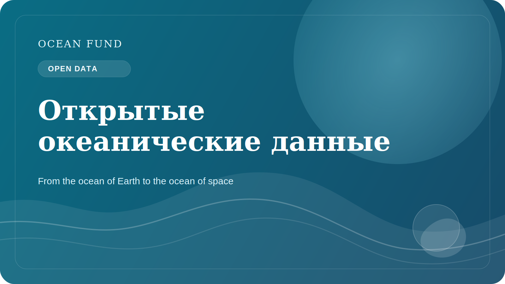

# Почему открытые океанические данные важны для общества

Сегодня разговор об океане невозможен без данных. Температура поверхности моря, соленость, батиметрия, спутниковые наблюдения, распределение видов, состояние кораллов, морской лед, загрязнение и прибрежные риски все чаще описываются не только словами, но и измерениями. Однако сами по себе данные еще не создают общественной пользы.

Открытые океанические данные важны потому, что они позволяют разным группам работать с одной и той же реальностью. Исследователь видит научный материал, преподаватель получает основу для урока, музей может сделать визуальную историю, журналист — проверить claim, а разработчик — построить инструмент или карту. Когда доступ к данным открыт, океаническая повестка перестает быть закрытым профессиональным клубом.

Но открытость не равна автоматической понятности. Даже хорошие данные часто остаются трудными для внешнего использования. У набора может быть сложная лицензия, неочевидные ограничения, технический формат, который непонятен не-специалисту, или метаданные, требующие отдельного перевода на человеческий язык. Поэтому между “данные существуют” и “общество может ими пользоваться” лежит большая работа по интерпретации.

Именно здесь особенно важны dataset cards, реестры источников, глоссарии, notebooks, демонстрационные карты и аккуратные public-facing briefs. Они не заменяют науку, но создают мост между специалистом и внешней аудиторией. Такой мост нужен не только для образования. Он нужен и для более ответственного разговора о рисках, инфраструктуре, климате, прибрежной политике и conservation.

Открытые данные также снижают зависимость от красивых, но пустых заявлений. Если проект говорит об океане, о его защите, о мониторинге или о blue economy, должен существовать способ проверить, на чем основаны формулировки. Наличие открытого источника, даты доступа, описания ограничений и статуса верификации делает публичную речь сильнее и честнее.

Для Ocean Fund открытые океанические данные — это не просто технический ресурс. Это основа для общественного доверия, образовательной работы и международного сотрудничества. Через открытые данные можно строить карты, лекции, briefs, event materials, партнерские предложения и исследовательские вопросы. Они помогают связать океаническую науку с обществом без потери точности.

В будущем значение этого слоя будет только расти. Чем больше будет спутниковых миссий, сенсорных сетей, подводных платформ и глобальных наблюдательных программ, тем важнее станет инфраструктура, которая помогает не утонуть в потоке информации. Обществу нужны не просто data portals, а понятные системы навигации по океаническим данным. Создание таких систем — это уже не второстепенная задача, а часть современной океанической культуры.

