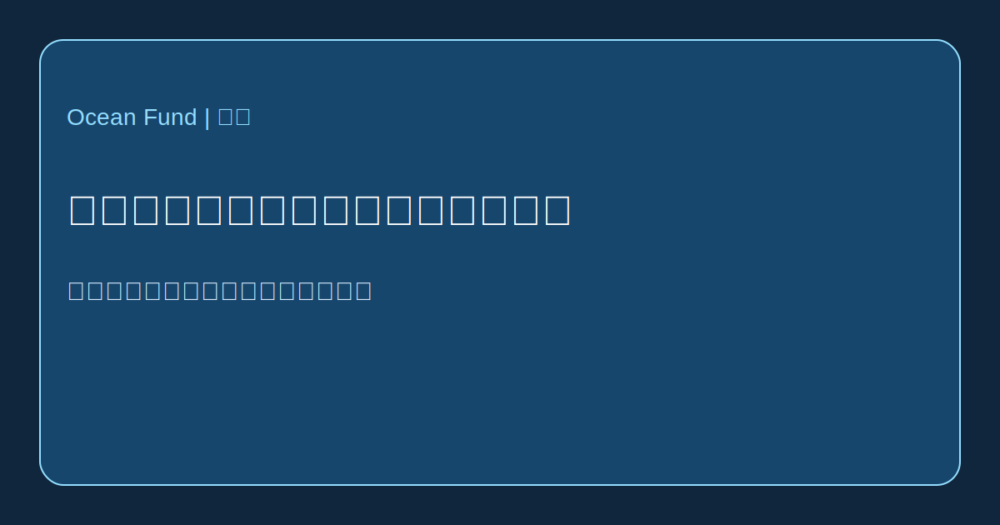

# 与水共生：漂浮城市与海洋城市主义

水上城市这一主题早已不再只是纯粹的科幻，但它依然处在实验、工程、气候适应与政治想象之间的边界地带。因此，既不能用兴奋的迷雾去看待它，也不能用自动化的怀疑来否定它。漂浮基础设施已经以多种形式存在。真正的问题已不再是能否在水上建造，而是这些系统具有什么公共目的，以及它们究竟服务于谁。

这一领域的一端，是气候适应与城市转型项目。[UN-Habitat](https://unhabitat.org/news/27-apr-2022/un-habitat-and-partners-unveil-oceanix-busan-the-worlds-first-prototype-floating) 与合作伙伴提出 OCEANIX Busan，将其作为面向海平面上升、土地稀缺与气候风险的沿海城市可持续漂浮扩展原型。这里的逻辑不是逃离陆地，而是寻找新的滨水发展方式。

另一端，则是与自治、海上社区和 seasteading 文化相关的更激进路线。[The Seasteading Institute](https://www.seasteading.org/about/) 直接把漂浮社区描述为社会实验空间，其 [active projects](https://www.seasteading.org/active-projects/) 也展示了更广泛的方向：海洋养殖、防波结构、居住平台和生产性海上基础设施。与此同时，像 [Ocean Builders](https://oceanbuilders.com/about-us/) 这样的公司，则把这一主题转化为产品设计、模块化住房和“海上生活”。

在这两个极点之间，还存在第三条路线：适应性水上建筑。像 [Waterstudio](https://www.waterstudio.nl/built-on-water-floating-houses/) 这样的实践，并不把漂浮建造视为脱离现实的乌托邦，而是把它看作在水环境变化条件下城市规划的延伸。这种逻辑更接近于重新设计城市、滨水区、基础设施与洪水风险之间的关系，而不是“在公海上建立一个全新文明”。

对 Ocean Fund 来说，必须同时抓住几组问题。谁将生活在水上？漂浮系统究竟是为了什么：奢侈、气候适应、科研、旅游、海洋养殖、临时居住，还是公共实验？废弃物、能源、淡水、维护、可达性、安全与法律地位如何处理？这些答案在赤道、温带和更冷的海域之间又如何变化？

这正是为什么 seasteading 和漂浮城市值得拥有严肃的研究层，而不是口号。在某些情形下，它们可能成为沿海韧性和新型海洋基础设施的有用工具；在另一些情形下，它们也可能只是昂贵而与公共利益联系薄弱的展示品。真正的工作就在这两端之间：比较模型、跟踪案例，并评估工程、生态和社会后果。

对 Ocean Fund 来说，这一主题不是异域插曲，而是“与水共生”这条更大路线的一部分。如果二十一世纪成为海岸承受气候压力的世纪，那么海洋城市主义的语言就不仅属于建筑师和投资者，也将属于研究者、记者、博物馆、城市与公共利益平台。谈论海洋的未来，也是在谈论未来如何在水上生活。
