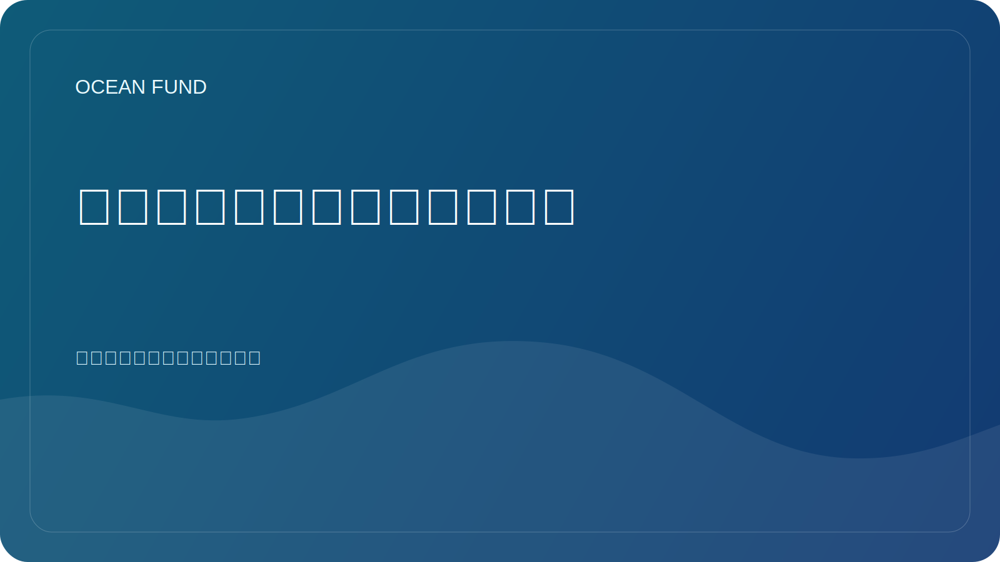

# 海洋生物多样性需要开放登记

海洋生物多样性巨大，但公众并不总是清楚可见。人们可能了解鲸鱼、珊瑚、鲨鱼或海龟，但海洋生命的实际结构要广泛得多、复杂得多。大量的生物体、生态系统和关系仍然超出了大众的认知范围。

这就是开放登记、目录和生物多样性数据系统如此重要的原因。它们不仅提供了存储数据的机会，还提供了以更系统的方式展示海洋生物的机会。通过这样的系统，可以了解物种分布、分类关系、历史观察、知识差距以及不同数据集之间的联系。

对于科学来说，这是基本的基础设施。但这对于社会来说同样重要。如果记者、教育家、博物馆馆长、学生或政策团队无法快速找到可靠的生物多样性参考点，那么有关保护的讨论就会变得薄弱。它依赖于孤立的清晰例子，而不是系统的理解。

开放注册也有助于对抗这两个极端。一方面，它们减少了混乱和重复。另一方面，它们可以防止以过于笼统和非操作性的术语谈论海洋生物的诱惑。当有注册表、图集或链接数据系统时，就可以更准确地表达。

对于海洋基金来说，这一层作为整体数据和知识基础设施的一部分非常重要。我们希望将科学、教育、公共叙事和合作伙伴工作联系起来。如果没有开放的生物多样性登记，这座桥梁将是不完整的。它们允许您创建数据集卡、教育笔记本、事件视觉效果、物种解释器和公共简报，这些不是基于随机事实，而是基于稳定的知识库。

海洋生物多样性不仅需要保护，还需要可见度。公共注册表是提供这种可见性形式的一种方式。这意味着它们不仅是数据文化的一部分，也是海洋责任文化的一部分。
