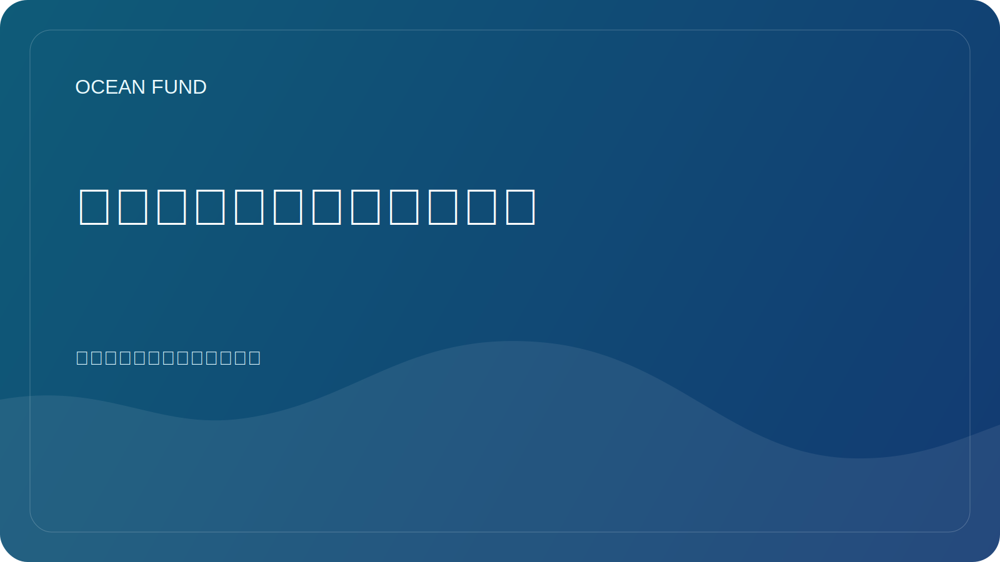

# 海洋指数和评级需要方法论

指数和评级看起来非常有吸引力。它们承诺快速比较、清晰的数字以及谈论复杂现实的便捷方式。在海洋议程中，这一点尤其诱人：太多的话题、太多的参与者、太多的不确定性。我想要至少一个简单的指标。

但这就是风险所在。系统越复杂，在尝试将其减少到单个数字或方便的比较规模时必须越小心。如果一个指数不能解释使用什么数据、如何选择权重、如何解释差距、如何解释不确定性以及到底测量什么，那么它就不是知识的工具，而是幻觉的工具。

如果海洋指数诚实地发挥作用，它们会非常有用。他们帮助发现模式、注意到地区之间的差异、建立政策对话并为组织、捐助者、研究人员和公共项目创建共同语言。但前提是该指数不隐藏美丽可视化背后的方法论。

对于海洋基金来说，这个主题尤其重要，因为我们已经有了内部和外部索引层：站点摘要、数据地图、地图集、发布队列、任务主题。这意味着该项目需要从一开始就创造一种方法透明的文化。如果我们称某个东西为索引、评级、登记册或图集，我们必须清楚地表明此类工具的边界。

一个好的指数不会将现实简化到空洞的地步。它可以帮助您导航，同时让您保持诚实。糟糕的指数给人一种精确的印象，因为只有一组可比性较差的信号。它们之间的区别在于方法论。

因此，关于海洋指数的讨论不仅应该在设计和沟通的层面上进行，而且还应该在认知责任的层面上进行。没有解释的数字可能比没有数字更危险。具有透明逻辑的指数可以成为导航复杂海洋世界的强大公共工具。
