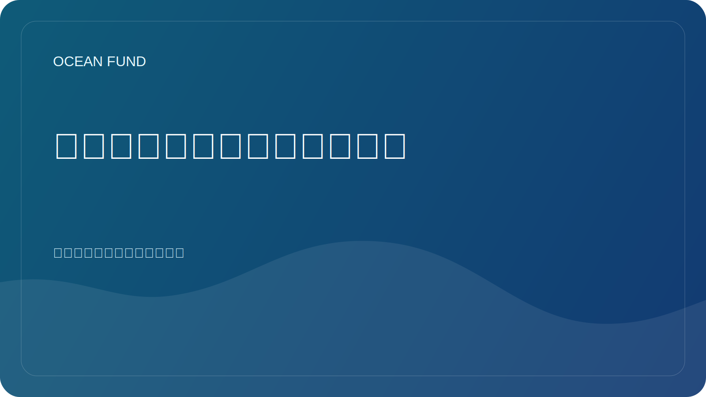

# 海洋素养作为未来的基础设施

海洋素养通常听起来像是一些额外的东西：一个有用的教育主题，一个博物馆的良好形式，一个学校项目的好东西。但实际上，需要更广泛地考虑海洋素养。这不是环境议程的装饰品，而是未来的基础设施之一。

如果一个社会对海洋的作用了解不够，那么它对气候、生物多样性、沿海风险、海洋资源、全球供应链甚至科学技术能力的了解也会较差。海洋文盲使得公共对话变得肤浅。然后决策就会变得被动而不是战略。

真正的海洋知识并不是关于鲸鱼和珊瑚的美丽事实的集合。它是将海洋视为一个复杂系统的能力，与陆地上的生命、全球气候、数据、国际政治、粮食系统以及对未来的想象息息相关。它还能够将经过科学证明的知识与简单化和流行但薄弱的主张区分开来。

在 21 世纪，这种素养不仅应该依赖于文本，还应该依赖于开放数据、地图、可视化、公民科学、博物馆实践、GitHub 存储库、公共简报、讲座和活动材料。也就是说，我们不再仅仅谈论教育，而是谈论互联的公共知识基础设施。

海洋基金正是建立在这个逻辑之上的。不仅研究对我们很重要，知识转化的形式也很重要。我们不仅需要数据集寄存器，还需要清晰的登录页面、单页程序、事件包、使命宣言和面向公众的文章。这一切并不是“二次包装”，而是海洋主题如何进入文化和决策的一部分。

展望未来，海洋素养只会变得更加重要。世界将面临关于蓝色经济、沿海复原力、海洋技术、深海治理以及海洋在气候适应中的作用的新辩论。决策的质量将取决于社会对这些对话的语言程度。

因此，海洋素养应理解为基础设施。它不像港口、卫星或实验室那样明显，但如果没有它，知识流动就会很差，伙伴关系就会减弱，公共议程就会容易受到噪音和操纵的影响。对于海洋基金来说，建设此类基础设施是其中心任务之一。
