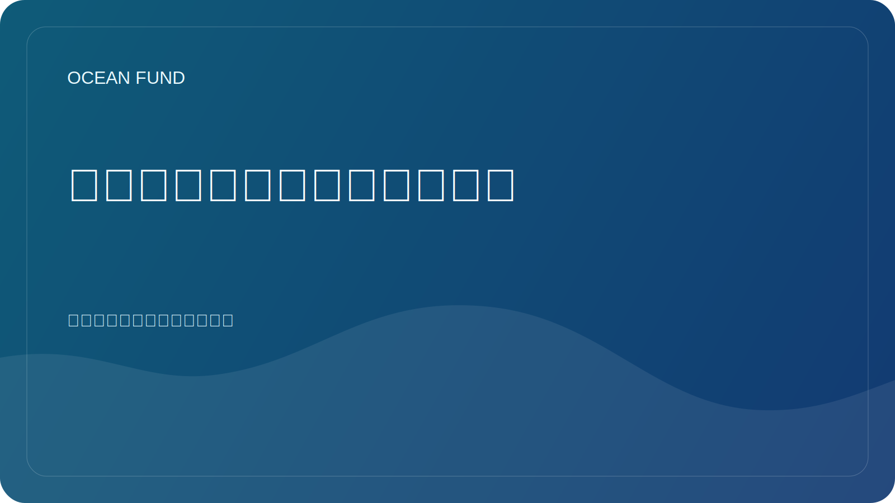

# 海洋技术需要清晰的公共语言

海洋科技发展迅速。自主平台、卫星服务、水下传感器、声学系统、测深测绘、海洋机器人、数据平台和新的分析工具正在不断扩展我们观察和与海洋合作的能力。但公众对这一层的理解却滞后。

通常，技术层要么被呈现为过于狭隘和工程化的东西，要么作为过于乐观的故事讲述的借口。在第一种情况下，该主题仍然不对广大受众开放。在第二种情况下，技术变成了一系列与限制、成本、风险和证据质量无关的承诺。

恰恰需要清晰的公共语言来避免这两种扭曲。他不应该把技术简化到毫无意义的地步，但也不应该用专业术语来概括它们。对于社会来说，了解传感器测量什么、观测平台如何工作、数据质量意味着什么、为什么需要校准以及为什么要校准非常重要。

这不仅对教育很重要。如果没有这样的语言，工程师、博物馆、基金会、大学、活动组织者和政策参与者之间就很难建立伙伴关系。他们每个人对相同技术的看法都不同。如果没有通用的翻译层，协作很快就会陷入停滞。

对于海洋基金来说，海洋技术并不是“工程师”的一个单独分支。它是一般公共知识基础设施的一部分。我们需要一种连接仪器、卫星观测、数据分析、教育、展览和海洋到太空叙事的语言。只有这样，技术才不再是黑匣子，而是成为可以理解的公共对话的一部分。

海洋议程的未来在很大程度上取决于社会能否在不天真的炒作和疏远的情况下谈论技术。创建这样一种语言已经是一项独立的工作。对于像海洋基金这样的项目，它应该被纳入公共材料的结构中。
