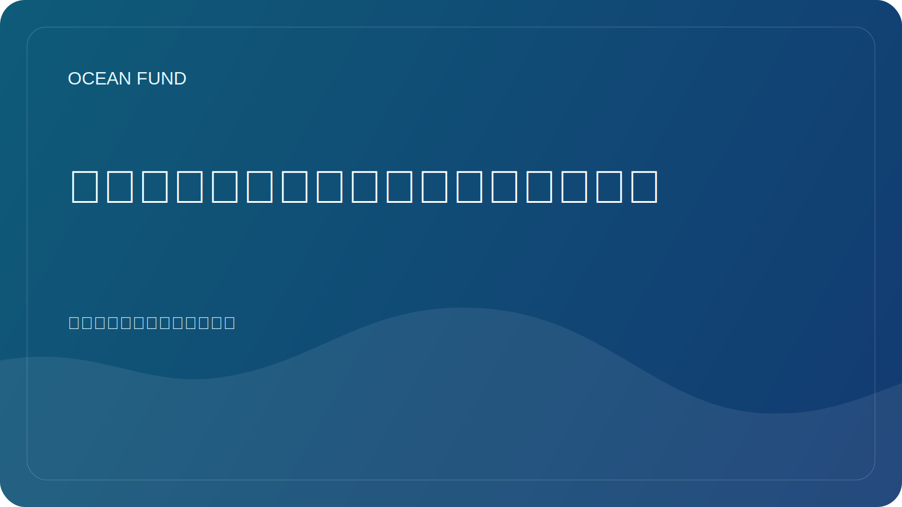

# 卫星和海洋：我们如何从上方观察地球

如果没有卫星，现代对海洋的了解是不可能的。如果说以前关于海洋环境的许多想法都是基于探险、浮标和海岸测量，那么今天从太空对地球的观测发挥着巨大的作用。正是这一点为我们提供了规模、可比性以及几乎实时观察大型空间过程的能力。

卫星可以观测海面温度、海洋颜色、冰分布、表面高度、大电流模式、浊度、浮游植物大量繁殖和许多其他特征。这并不意味着传统的测量变得不必要，而是从根本上增强了传统测量的功能，使局部观测结果能够与全球情况联系起来。

这种联系对于气候、沿海可持续发展和教育工作尤其重要。当我们从上方观察海洋时，我们会更清楚地看到，它不是静态的“蓝色物体”，而是一个具有锋面、涡流、季节循环、生物激增和大型气候模式的动态系统。太空观测改变了我们对海洋的认知。

但在这里也需要谨慎。卫星图像不是“真实的直接照片”，而是复杂处理、模型、校准和解释的结果。因此，卫星数据的公共工作需要良好的来源、明确的免责声明以及对限制的明确解释。否则，美丽的图像可能会得出错误的结论。

对于海洋基金来说，卫星层尤其重要，因为它自然地将地球海洋与太空海洋连接起来。我们通过大气层外的仪器研究海洋环境。这在海洋学、地球观测、太空任务和长期探索之间架起了一座强大的教育和知识桥梁。

这是海洋主题的优势之一：当我们能够从内部和上方观察地球时，它有助于我们更好地理解地球这个系统。卫星使这种观点成为可能。而像海洋基金这样的公共平台的任务就是将其翻译成一种易于理解、简洁且对社会有用的语言。
