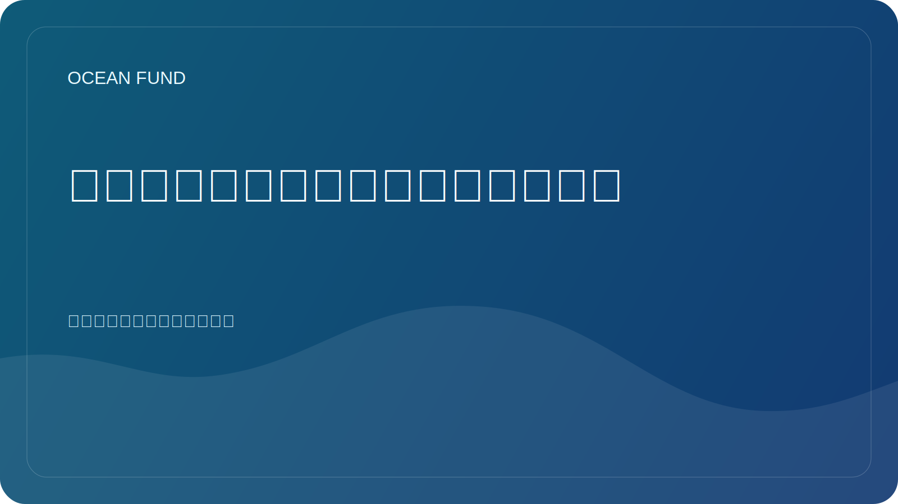

# 为什么海洋会议不仅对于交流很重要

在外部观察者看来，海洋会议通常是会谈、小组讨论、展位和商务会议的混合体。在这种形式下，它们看起来就像是专业社区的一种仪式。但实际上，良好的海洋活动发挥着更重要的作用：它们有助于将研究、政策、数据、教育、技术和公共传播联系起来。

海洋议程太复杂，无法在单一学科中生存。海洋生物学家、卫星分析师、博物馆馆长、海岸规划师、传感器开发人员、慈善资助者和教育项目组织者很少在同一个日常工作中工作。会议和论坛成为这些不同语言至少暂时统一的场所。

这就是为什么高质量的活动空间不仅对于社交很重要。层间传输需要它。科学成果必须符合公众传播。数据平台应与教育者或博物馆团队会面。政策讨论应该听到生态系统科学，技术乐观应该听到局限性和风险。

对于海洋基金来说，这一层尤为重要。该项目是作为一个开放的基础设施建设的，而不是作为一个封闭的研究小组。这意味着我们不仅需要将活动作为自我展示的场所，而且还需要将其作为侦察、测试语言、寻找合作伙伴、比较主题以及将想法转化为具体材料（简报、一页纸、数据集卡、研讨会和公共资料包）的场所。

认真对待海洋事件还有另一个原因。他们塑造了未来几年社会如何看待海洋主题。如果舞台上仅充斥着响亮的口号、炒作或模糊的承诺，那么公共议程就会变得薄弱。如果该活动与数据、方法论、生态系统责任和良好的科学转化相关，那么它确实会推动该领域向前发展。

因此，海洋会议、展览和论坛并不是次要的“交流”层。它是海洋知识基础设施的一部分。我们学得越好地利用这些空间，海洋、社会和未来解决方案之间的联系就会越紧密。
