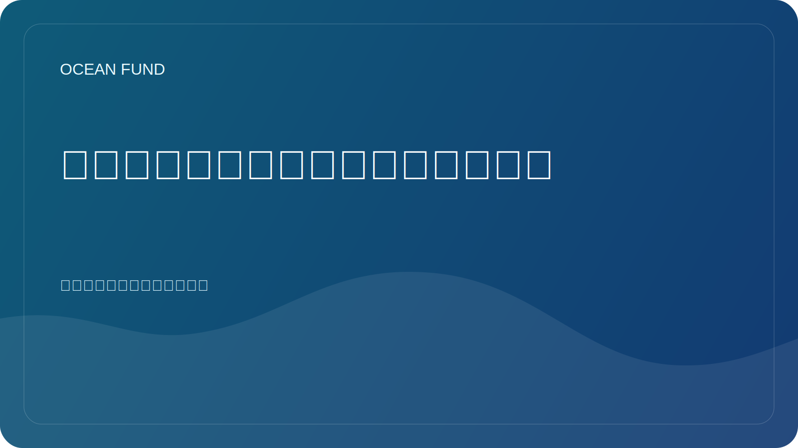

# 为什么海洋组织需要开放的公共中心

许多海洋组织制作有用的材料：研究、演示、地图、政策简报、活动计划、教育文本、信件、数据集和可视化。但这些材料常常存在于不同的系统中。有些东西在邮件中，有些东西在云文件夹中，有些东西在网站上，有些东西在团队的个人文件夹中，有些东西在项目完成后就消失了。

这里的问题不仅仅是不方便。碎片化削弱了组织的公众形象。对于局外人来说，很难理解这是什么类型的项目、它代表什么、如何参与、已经存在哪些材料以及如何区分草案和公开准备的输出。

开放的公共枢纽不是通过精美的设计，而是通过清晰的架构来解决这个问题。它应该将使命、研究方向、数据源、活动包、单页机、治理说明、问题队列和参与路线收集在一处。然后，该项目就不再依赖于个人的记忆，而是开始作为一个系统运行。

这对于海洋议程尤其重要。科学、数据、教育、技术和伙伴关系之间存在太多交叉点。如果一个组织没有稳定的公共核心，那么每次新的沟通几乎都是从头开始。该团队花费精力重复基本解释，而不是开发该领域。

从这个逻辑来看，GitHub 的有趣之处不仅在于它是一个存放代码的地方。它可以充当开放的操作存储器：文档、文章、问题、讨论、数据寄存器和面向合作伙伴的材料相互关联的空间。这种方法增强了信任，因为它显示了材料的结构、状态和运动方向。

对于海洋基金来说，开放枢纽不是一个辅助工具，而是项目的主要存在形式之一。如果一个海洋组织想要变得易于理解、可验证和易于协作，它需要的不仅仅是一个网站，也不仅仅是一个文件文件夹，而是一个活生生的公共系统。这就是开放集线器成为战略资产而不是技术细节的原因。
