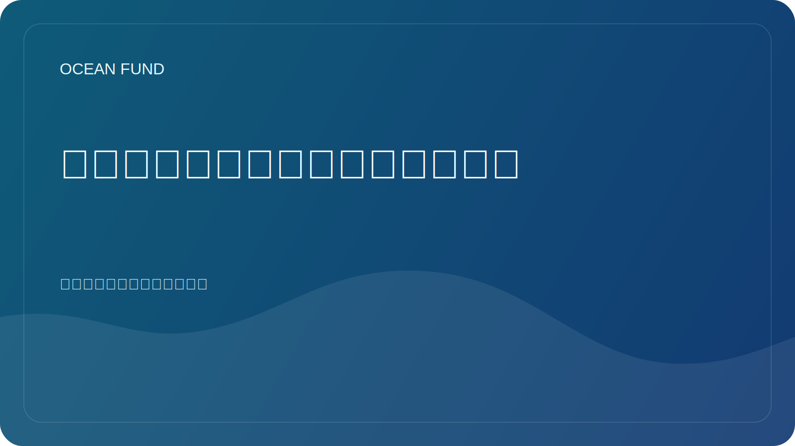

# 为什么开放海洋数据对社会很重要

如今，没有数据就不可能谈论海洋。海面温度、盐度、测深、卫星观测、物种分布、珊瑚健康、海冰、污染和沿海风险越来越多地不仅用文字描述，而且用测量来描述。然而，数据本身并不能创造公共利益。

开放海洋数据很重要，因为它允许不同的团队处理相同的现实。研究人员可以查看科学材料，教师可以了解课程的基础，博物馆可以制作视觉故事，记者可以检查声明，开发人员可以构建工具或地图。当数据访问开放时，海洋议程就不再是一个封闭的职业俱乐部。

但开放性并不等于自动可理解性。即使是好的数据通常也很难在外部使用。集合可能具有复杂的许可证、不明显的限制、非专业人士难以理解的技术格式，或者需要单独翻译成人类语言的元数据。因此，在“数据存在”和“社会可以使用它”之间存在大量的解释工作。

这就是数据集卡、源寄存器、术语表、笔记本、演示卡和简洁的面向公众的简介尤其重要的地方。它们不会取代科学，而是在专家和外部受众之间架起一座桥梁。这样一座桥梁不仅是教育所需要的。还需要就风险、基础设施、气候、沿海政策和保护进行更负责任的对话。

开放数据还减少了对花哨但空洞的主张的依赖。如果一个项目谈论海洋、海洋保护、监测或蓝色经济，必须有一种方法来检查措辞的基础是什么。拥有开源、访问日期、限制描述和验证状态使公开言论更有力、更诚实。

对于海洋基金来说，开放海洋数据不仅仅是一种技术资源。这是公众信任、教育工作和国际合作的基础。通过开放数据，您可以构建地图、讲座、简报、活动材料、合作伙伴提案和研究问题。它们帮助将海洋科学与社会联系起来，同时又不失严谨性。

未来，这一层的重要性只会越来越大。随着越来越多的卫星任务、传感器网络、海底平台和全球观测计划的出现，防止我们淹没在信息洪流中的基础设施将变得更加重要。社会不仅需要数据门户，还需要基于海洋数据的清晰导航系统。创建此类系统不再是次要任务，而是现代海洋文化的一部分。
