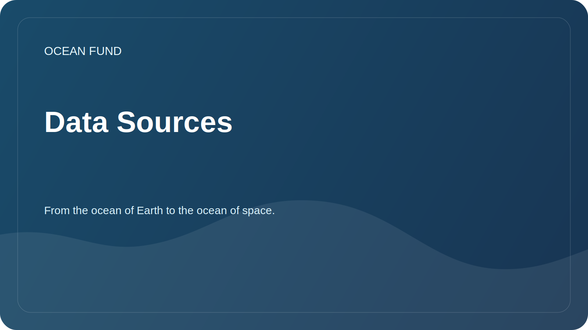

# Data Sources

The Ocean Foundation explores open data sources that can be useful for research, education, visualization and community projects.

## Priority directions

| Source | Potential value | What to check |
| --- | --- | --- |
| Copernicus Marine | Oceanographic data, models, monitoring | Licenses, API, spatial and temporal coverage |
| OBIS | Marine Biodiversity Data | Taxonomy, post quality, citations |
| GEBCO | Bathymetric grids and bottom topography | Permission, restrictions of use |
| EMODnet | European maritime data on several topics | Accessibility, metadata, standards |
| NOAA / IOS | Observations, buoys, weather and ocean data | API, updateability, regionality |
| FathomNet | Annotated underwater images | Licenses, label quality, applicability for ML |
| AN Ocean Decade | Programs, projects, cooperation frameworks | Status of initiatives and opportunities for participation |
| Satellite and bathymetric data | Surface temperature, chlorophyll, ice, depths | Sources, processing, errors |

## Minimal source card

- Name;
- operator organization;
- link;
- data type;
- geographical coverage;
- temporary coverage;
- license;
- access method;
- example of research application;
- date checks.

A detailed working register is located in [`data/datasets-register.md`](../../data/datasets-register.md).
